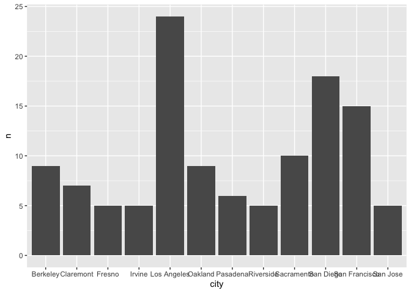
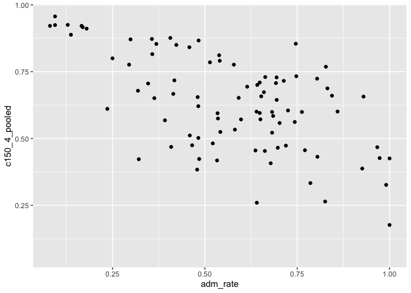
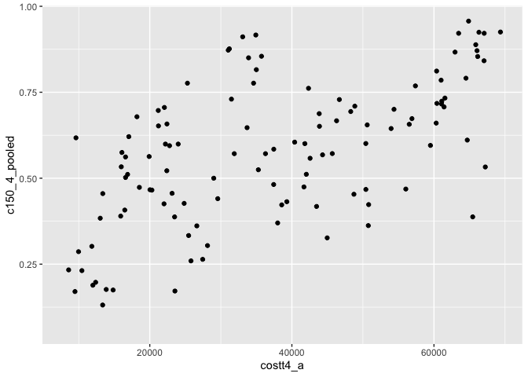

## Instructions
Answer the following questions and complete the exercises in RMarkdown. Please embed all of your code and push your final work to your repository. Your final lab report should be organized, clean, and run free from errors. Remember, you must remove the `#` for the included code chunks to run. Be sure to add your name to the author header above.  

Make sure to use the formatting conventions of RMarkdown to make your report neat and clean!  

## Load the libraries

```r
library(tidyverse)
library(janitor)
library(here)
library(naniar)
```

For this homework, we will take a departure from biological data and use data about California colleges. These data are a subset of the national college scorecard (https://collegescorecard.ed.gov/data/). Load the `ca_college_data.csv` as a new object called `colleges`.

```r
colleges <- readr::read_csv("data/ca_college_data.csv")
```

```
## Rows: 341 Columns: 10
## ── Column specification ────────────────────────────────────────────────────────
## Delimiter: ","
## chr (4): INSTNM, CITY, STABBR, ZIP
## dbl (6): ADM_RATE, SAT_AVG, PCIP26, COSTT4_A, C150_4_POOLED, PFTFTUG1_EF
## 
## ℹ Use `spec()` to retrieve the full column specification for this data.
## ℹ Specify the column types or set `show_col_types = FALSE` to quiet this message.
```

The variables are a bit hard to decipher, here is a key:  

INSTNM: Institution name  
CITY: California city  
STABBR: Location state  
ZIP: Zip code  
ADM_RATE: Admission rate  
SAT_AVG: SAT average score  
PCIP26: Percentage of degrees awarded in Biological And Biomedical Sciences  
COSTT4_A: Annual cost of attendance  
C150_4_POOLED: 4-year completion rate  
PFTFTUG1_EF: Percentage of undergraduate students who are first-time, full-time degree/certificate-seeking undergraduate students  

1. Use your preferred function(s) to have a look at the data and get an idea of its structure. Make sure you summarize NA's and determine whether or not the data are tidy. You may also consider dealing with any naming issues.

```r
glimpse(colleges)
```

```
## Rows: 341
## Columns: 10
## $ INSTNM        <chr> "Grossmont College", "College of the Sequoias", "College…
## $ CITY          <chr> "El Cajon", "Visalia", "San Mateo", "Ventura", "Oxnard",…
## $ STABBR        <chr> "CA", "CA", "CA", "CA", "CA", "CA", "CA", "CA", "CA", "C…
## $ ZIP           <chr> "92020-1799", "93277-2214", "94402-3784", "93003-3872", …
## $ ADM_RATE      <dbl> NA, NA, NA, NA, NA, NA, NA, NA, NA, NA, NA, NA, NA, NA, …
## $ SAT_AVG       <dbl> NA, NA, NA, NA, NA, NA, NA, NA, NA, NA, NA, NA, NA, NA, …
## $ PCIP26        <dbl> 0.0016, 0.0066, 0.0038, 0.0035, 0.0085, 0.0151, 0.0000, …
## $ COSTT4_A      <dbl> 7956, 8109, 8278, 8407, 8516, 8577, 8580, 9181, 9281, 93…
## $ C150_4_POOLED <dbl> NA, NA, NA, NA, NA, NA, 0.2334, NA, NA, NA, NA, 0.1704, …
## $ PFTFTUG1_EF   <dbl> 0.3546, 0.5413, 0.3567, 0.3824, 0.2753, 0.4286, 0.2307, …
```


```r
naniar::miss_var_summary(colleges)
```

```
## # A tibble: 10 × 3
##    variable      n_miss pct_miss
##    <chr>          <int>    <dbl>
##  1 SAT_AVG          276     80.9
##  2 ADM_RATE         240     70.4
##  3 C150_4_POOLED    221     64.8
##  4 COSTT4_A         124     36.4
##  5 PFTFTUG1_EF       53     15.5
##  6 PCIP26            35     10.3
##  7 INSTNM             0      0  
##  8 CITY               0      0  
##  9 STABBR             0      0  
## 10 ZIP                0      0
```


```r
colleges <- janitor::clean_names(colleges)
```

2. Which cities in California have the highest number of colleges?
These five cities in California have the highest number of colleges

```r
colleges %>% 
  tabyl(city) %>% 
  slice_max(n, n=5)
```

```
##           city  n    percent
##    Los Angeles 24 0.07038123
##      San Diego 18 0.05278592
##  San Francisco 15 0.04398827
##     Sacramento 10 0.02932551
##       Berkeley  9 0.02639296
##        Oakland  9 0.02639296
```

3. Based on your answer to #2, make a plot that shows the number of colleges in the top 10 cities.

```r
colleges %>% 
  count(city) %>% 
  slice_max(n, n=10) %>% 
  ggplot(aes(x=city, y=n)) + geom_col()
```

<!-- -->

4. The column `COSTT4_A` is the annual cost of each institution. Which city has the highest average cost? Where is it located?
Claremont has the highest average cost of tuition. Claremont is a suburb in eastern LA county. The institution with the highest cost is Harvey Mudd College. 


```r
colleges %>% 
  select(instnm, costt4_a, city) %>% 
  filter(city=="Los Angeles") %>% 
  mutate(sum_costt4_a= sum(costt4_a, na.rm=T)) %>% 
  mutate(mean_cost = sum_costt4_a/24)
```

```
## # A tibble: 24 × 5
##    instnm                                          costt…¹ city  sum_c…² mean_…³
##    <chr>                                             <dbl> <chr>   <dbl>   <dbl>
##  1 Los Angeles Southwest College                     12190 Los …  611936  25497.
##  2 Los Angeles City College                          12272 Los …  611936  25497.
##  3 Los Angeles Trade Technical College               12422 Los …  611936  25497.
##  4 California State University-Los Angeles           13385 Los …  611936  25497.
##  5 Yeshiva Ohr Elchonon Chabad West Coast Talmudi…   25800 Los …  611936  25497.
##  6 University of California-Los Angeles              33078 Los …  611936  25497.
##  7 American Jewish University                        36286 Los …  611936  25497.
##  8 FIDM-Fashion Institute of Design & Merchandisi…   46291 Los …  611936  25497.
##  9 Mount Saint Mary's University                     50406 Los …  611936  25497.
## 10 American Academy of Dramatic Arts-Los Angeles     51581 Los …  611936  25497.
## # … with 14 more rows, and abbreviated variable names ¹​costt4_a, ²​sum_costt4_a,
## #   ³​mean_cost
```


```r
colleges %>% 
  select(instnm, costt4_a, city) %>% 
  filter(city=="Claremont") %>% 
  mutate(sum_costt4_a= sum(costt4_a, na.rm=T)) %>% 
  mutate(mean_cost = sum_costt4_a/7)
```

```
## # A tibble: 7 × 5
##   instnm                        costt4_a city      sum_costt4_a mean_cost
##   <chr>                            <dbl> <chr>            <dbl>     <dbl>
## 1 Pomona College                   64870 Claremont       332490    47499.
## 2 Pitzer College                   65880 Claremont       332490    47499.
## 3 Scripps College                  66060 Claremont       332490    47499.
## 4 Claremont McKenna College        66325 Claremont       332490    47499.
## 5 Harvey Mudd College              69355 Claremont       332490    47499.
## 6 Claremont Graduate University       NA Claremont       332490    47499.
## 7 Claremont School of Theology        NA Claremont       332490    47499.
```


```r
colleges %>% 
  select(instnm, costt4_a, city) %>% 
  filter(city=="San Francisco") %>% 
  mutate(sum_costt4_a= sum(costt4_a, na.rm=T)) %>% 
  mutate(mean_cost = sum_costt4_a/15)
```

```
## # A tibble: 15 × 5
##    instnm                                          costt…¹ city  sum_c…² mean_…³
##    <chr>                                             <dbl> <chr>   <dbl>   <dbl>
##  1 City College of San Francisco                     10333 San …  436999  29133.
##  2 San Francisco State University                    22396 San …  436999  29133.
##  3 Argosy University-The Art Institute of Califor…   28125 San …  436999  29133.
##  4 Academy of Art University                         38000 San …  436999  29133.
##  5 FIDM-Fashion Institute of Design & Merchandisi…   43881 San …  436999  29133.
##  6 American Conservatory Theater                     47827 San …  436999  29133.
##  7 California College of the Arts                    59502 San …  436999  29133.
##  8 San Francisco Conservatory of Music               60410 San …  436999  29133.
##  9 University of San Francisco                       61072 San …  436999  29133.
## 10 San Francisco Art Institute                       65453 San …  436999  29133.
## 11 California Institute of Integral Studies             NA San …  436999  29133.
## 12 University of California-Hastings College of L…      NA San …  436999  29133.
## 13 University of California-San Francisco               NA San …  436999  29133.
## 14 Le Cordon Bleu College of Culinary Arts-San Fr…      NA San …  436999  29133.
## 15 Golden Gate University-San Francisco                 NA San …  436999  29133.
## # … with abbreviated variable names ¹​costt4_a, ²​sum_costt4_a, ³​mean_cost
```

5. Based on your answer to #4, make a plot that compares the cost of the individual colleges in the most expensive city. Bonus! Add UC Davis here to see how it compares :>).


```r
colleges %>% 
  select(instnm, costt4_a, city) %>% 
  filter(city=="Claremont"| city=="Davis") %>% 
  mutate(sum_costt4_a= sum(costt4_a, na.rm=T)) %>% 
  mutate(mean_cost = sum_costt4_a/7) %>% 
  ggplot(aes(x=instnm, y=costt4_a)) + geom_col()
```

```
## Warning: Removed 2 rows containing missing values (`position_stack()`).
```

<!-- -->

6. The column `ADM_RATE` is the admissions rate by college and `C150_4_POOLED` is the four-year completion rate. Use a scatterplot to show the relationship between these two variables. What do you think this means?
As colleges are more selective, four-year completion is more likely to occur. 

```r
colleges %>% 
  ggplot(aes(x=adm_rate, y=c150_4_pooled)) + geom_point()
```

```
## Warning: Removed 251 rows containing missing values (`geom_point()`).
```

<!-- -->

7. Is there a relationship between cost and four-year completion rate? (You don't need to do the stats, just produce a plot). What do you think this means?
As the price of college increases, four year completion is more likely to occur.

```r
colleges %>% 
  ggplot(aes(x=costt4_a, y=c150_4_pooled)) + geom_point()
```

```
## Warning: Removed 225 rows containing missing values (`geom_point()`).
```

<!-- -->

8. The column titled `INSTNM` is the institution name. We are only interested in the University of California colleges. Make a new data frame that is restricted to UC institutions. You can remove `Hastings College of Law` and `UC San Francisco` as we are only interested in undergraduate institutions.

```r
uc <- colleges %>%
  filter_all(any_vars(str_detect(.,pattern= "University of California")))
```

Remove `Hastings College of Law` and `UC San Francisco` and store the final data frame as a new object `univ_calif_final`.

```r
univ_calif_final <- uc %>% 
  slice_head(n=8)
```

Use `separate()` to separate institution name into two new columns "UNIV" and "CAMPUS".

```r
new_uc <- univ_calif_final %>% 
  separate(instnm, into = c("univ", "campus"), sep = "-")
```

9. The column `ADM_RATE` is the admissions rate by campus. Which UC has the lowest and highest admissions rates? Produce a numerical summary and an appropriate plot.
UC Berkeley has the lowest admission rate while UC Riverside has the highest admissions rate.

```r
new_uc %>% 
  select(campus, adm_rate) %>% 
  arrange(adm_rate)
```

```
## # A tibble: 8 × 2
##   campus        adm_rate
##   <chr>            <dbl>
## 1 Berkeley         0.169
## 2 Los Angeles      0.180
## 3 San Diego        0.357
## 4 Santa Barbara    0.358
## 5 Irvine           0.406
## 6 Davis            0.423
## 7 Santa Cruz       0.578
## 8 Riverside        0.663
```


```r
new_uc %>% 
  select(campus, adm_rate) %>% 
  arrange(adm_rate) %>% 
  ggplot(aes(x = campus, y = adm_rate)) + geom_col()
```

<!-- -->

10. If you wanted to get a degree in biological or biomedical sciences, which campus confers the majority of these degrees? Produce a numerical summary and an appropriate plot.
UC San Diego

```r
new_uc %>% 
  select(campus, pcip26) %>% 
  arrange(desc(pcip26))
```

```
## # A tibble: 8 × 2
##   campus        pcip26
##   <chr>          <dbl>
## 1 San Diego      0.216
## 2 Davis          0.198
## 3 Santa Cruz     0.193
## 4 Los Angeles    0.155
## 5 Riverside      0.149
## 6 Santa Barbara  0.108
## 7 Irvine         0.107
## 8 Berkeley       0.105
```


```r
new_uc %>% 
  select(campus, pcip26) %>% 
  arrange(desc(pcip26)) %>% 
  ggplot(aes(x=campus, y=pcip26)) + geom_col()
```

<!-- -->

## Knit Your Output and Post to [GitHub](https://github.com/FRS417-DataScienceBiologists)
