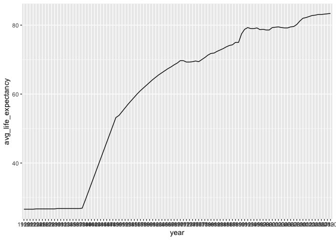
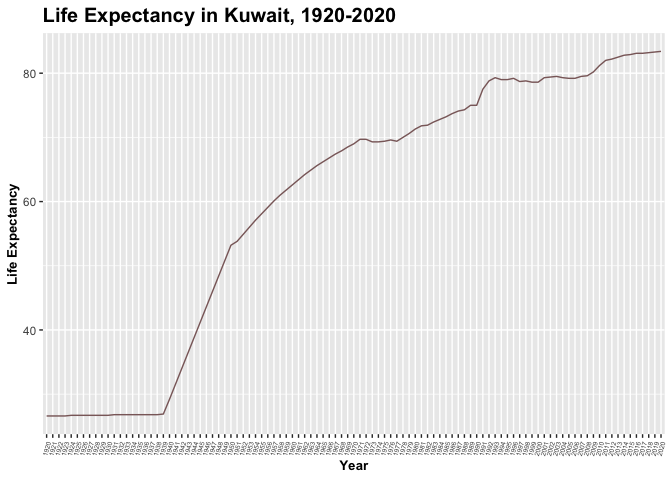
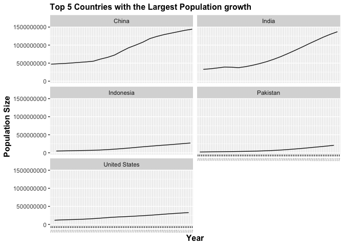
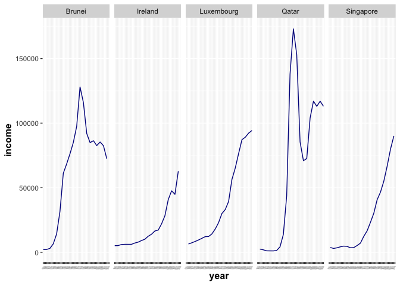

## Instructions
Answer the following questions and complete the exercises in RMarkdown. Please embed all of your code and push your final work to your repository. Your code should be organized, clean, and run free from errors. Be sure to **add your name** to the author header above. You may use any resources to answer these questions (including each other), but you may not post questions to Open Stacks or external help sites. There are 10 total questions.  

Make sure to use the formatting conventions of RMarkdown to make your report neat and clean! Your plots should use consistent aesthetics throughout.  

This exam is due by **12:00p on Tuesday, February 22**.  

## Load the libraries

```r
library(tidyverse)
```

```
## ── Attaching packages ─────────────────────────────────────── tidyverse 1.3.2 ──
## ✔ ggplot2 3.4.0      ✔ purrr   1.0.1 
## ✔ tibble  3.1.8      ✔ dplyr   1.0.10
## ✔ tidyr   1.2.1      ✔ stringr 1.5.0 
## ✔ readr   2.1.3      ✔ forcats 0.5.2 
## ── Conflicts ────────────────────────────────────────── tidyverse_conflicts() ──
## ✖ dplyr::filter() masks stats::filter()
## ✖ dplyr::lag()    masks stats::lag()
```

```r
library(janitor)
```

```
## 
## Attaching package: 'janitor'
## 
## The following objects are masked from 'package:stats':
## 
##     chisq.test, fisher.test
```

```r
options(scipen=999) #disables scientific notation when printing
```


```r
library(here)
```

```
## here() starts at /Users/ayanacarpenter/Desktop/BIS15W2023_acarpenter
```

## Gapminder
For this assignment, we are going to use data from  [gapminder](https://www.gapminder.org/). Gapminder includes information about economics, population, social issues, and life expectancy from countries all over the world. We will use three data sets, so please load all three.  

1. population_total.csv  
2. income_per_person_gdppercapita_ppp_inflation_adjusted.csv  
3. life_expectancy_years.csv  


```r
population <- readr::read_csv("data/population_total.csv")
```

```
## Rows: 195 Columns: 302
## ── Column specification ────────────────────────────────────────────────────────
## Delimiter: ","
## chr   (1): country
## dbl (301): 1800, 1801, 1802, 1803, 1804, 1805, 1806, 1807, 1808, 1809, 1810,...
## 
## ℹ Use `spec()` to retrieve the full column specification for this data.
## ℹ Specify the column types or set `show_col_types = FALSE` to quiet this message.
```


```r
income <- readr::read_csv("data/income_per_person_gdppercapita_ppp_inflation_adjusted.csv")
```

```
## Rows: 193 Columns: 242
## ── Column specification ────────────────────────────────────────────────────────
## Delimiter: ","
## chr   (1): country
## dbl (241): 1800, 1801, 1802, 1803, 1804, 1805, 1806, 1807, 1808, 1809, 1810,...
## 
## ℹ Use `spec()` to retrieve the full column specification for this data.
## ℹ Specify the column types or set `show_col_types = FALSE` to quiet this message.
```


```r
life_expectancy <- readr::read_csv("data/life_expectancy_years.csv")
```

```
## Rows: 187 Columns: 302
## ── Column specification ────────────────────────────────────────────────────────
## Delimiter: ","
## chr   (1): country
## dbl (301): 1800, 1801, 1802, 1803, 1804, 1805, 1806, 1807, 1808, 1809, 1810,...
## 
## ℹ Use `spec()` to retrieve the full column specification for this data.
## ℹ Specify the column types or set `show_col_types = FALSE` to quiet this message.
```


```r
glimpse(income)
```

```
## Rows: 193
## Columns: 242
## $ country <chr> "Afghanistan", "Albania", "Algeria", "Andorra", "Angola", "Ant…
## $ `1800`  <dbl> 603, 667, 715, 1200, 618, 757, 1640, 514, 817, 1850, 775, 1450…
## $ `1801`  <dbl> 603, 667, 716, 1200, 620, 757, 1640, 514, 822, 1850, 775, 1450…
## $ `1802`  <dbl> 603, 667, 717, 1200, 623, 757, 1650, 514, 826, 1860, 775, 1450…
## $ `1803`  <dbl> 603, 667, 718, 1200, 626, 757, 1650, 514, 831, 1870, 775, 1450…
## $ `1804`  <dbl> 603, 667, 719, 1210, 628, 757, 1660, 514, 836, 1880, 775, 1450…
## $ `1805`  <dbl> 603, 668, 720, 1210, 631, 757, 1660, 514, 841, 1880, 776, 1450…
## $ `1806`  <dbl> 603, 668, 721, 1210, 634, 757, 1670, 514, 845, 1890, 776, 1450…
## $ `1807`  <dbl> 603, 668, 722, 1210, 637, 758, 1680, 514, 850, 1900, 776, 1450…
## $ `1808`  <dbl> 603, 668, 723, 1220, 640, 758, 1680, 514, 855, 1910, 776, 1450…
## $ `1809`  <dbl> 603, 668, 724, 1220, 642, 758, 1690, 514, 860, 1920, 776, 1450…
## $ `1810`  <dbl> 604, 668, 725, 1220, 645, 758, 1690, 514, 865, 1920, 777, 1450…
## $ `1811`  <dbl> 604, 668, 726, 1220, 648, 758, 1700, 515, 869, 1940, 777, 1450…
## $ `1812`  <dbl> 604, 668, 727, 1220, 651, 758, 1710, 515, 874, 1960, 777, 1450…
## $ `1813`  <dbl> 604, 668, 728, 1230, 654, 758, 1710, 515, 879, 1980, 777, 1450…
## $ `1814`  <dbl> 604, 668, 729, 1230, 657, 758, 1720, 515, 884, 2000, 777, 1450…
## $ `1815`  <dbl> 604, 669, 730, 1230, 660, 758, 1720, 515, 889, 2020, 778, 1450…
## $ `1816`  <dbl> 604, 669, 731, 1230, 662, 759, 1730, 515, 894, 2040, 778, 1450…
## $ `1817`  <dbl> 604, 669, 732, 1240, 665, 759, 1740, 515, 899, 2050, 778, 1450…
## $ `1818`  <dbl> 604, 669, 733, 1240, 668, 759, 1740, 515, 904, 2070, 778, 1450…
## $ `1819`  <dbl> 604, 669, 734, 1240, 671, 759, 1750, 515, 910, 2090, 778, 1450…
## $ `1820`  <dbl> 604, 669, 735, 1240, 674, 759, 1750, 515, 941, 2110, 779, 1450…
## $ `1821`  <dbl> 607, 671, 743, 1260, 677, 764, 1770, 517, 950, 2140, 783, 1460…
## $ `1822`  <dbl> 609, 672, 751, 1270, 680, 769, 1780, 519, 977, 2170, 787, 1470…
## $ `1823`  <dbl> 611, 674, 759, 1290, 683, 775, 1790, 521, 1010, 2200, 792, 148…
## $ `1824`  <dbl> 613, 675, 767, 1300, 686, 780, 1810, 523, 1070, 2230, 796, 149…
## $ `1825`  <dbl> 615, 677, 775, 1320, 689, 785, 1820, 525, 1120, 2260, 800, 150…
## $ `1826`  <dbl> 617, 678, 784, 1330, 692, 790, 1830, 527, 1140, 2300, 805, 151…
## $ `1827`  <dbl> 619, 680, 792, 1350, 695, 796, 1850, 529, 1170, 2330, 809, 152…
## $ `1828`  <dbl> 621, 681, 801, 1370, 698, 801, 1860, 531, 1200, 2360, 814, 153…
## $ `1829`  <dbl> 623, 683, 810, 1380, 701, 806, 1880, 533, 1270, 2390, 818, 154…
## $ `1830`  <dbl> 625, 684, 819, 1400, 704, 812, 1890, 535, 1540, 2430, 823, 155…
## $ `1831`  <dbl> 627, 686, 828, 1410, 708, 817, 1910, 538, 1590, 2440, 827, 156…
## $ `1832`  <dbl> 630, 688, 837, 1430, 711, 823, 1920, 540, 1630, 2460, 832, 157…
## $ `1833`  <dbl> 632, 689, 846, 1450, 714, 828, 1930, 542, 1640, 2480, 837, 158…
## $ `1834`  <dbl> 634, 691, 855, 1470, 717, 834, 1950, 544, 1720, 2500, 841, 159…
## $ `1835`  <dbl> 636, 692, 864, 1480, 720, 840, 1960, 546, 2080, 2520, 846, 160…
## $ `1836`  <dbl> 638, 694, 874, 1500, 723, 845, 1980, 548, 2050, 2540, 851, 161…
## $ `1837`  <dbl> 640, 695, 883, 1520, 726, 851, 1990, 550, 2140, 2560, 855, 163…
## $ `1838`  <dbl> 643, 697, 893, 1540, 730, 857, 2010, 552, 2120, 2590, 860, 164…
## $ `1839`  <dbl> 645, 699, 903, 1550, 733, 863, 2020, 554, 1980, 2610, 865, 165…
## $ `1840`  <dbl> 647, 700, 912, 1570, 736, 868, 2040, 556, 2500, 2630, 870, 166…
## $ `1841`  <dbl> 649, 702, 922, 1590, 739, 874, 2050, 559, 2130, 2650, 874, 167…
## $ `1842`  <dbl> 651, 703, 932, 1610, 743, 880, 2070, 561, 1940, 2670, 879, 168…
## $ `1843`  <dbl> 654, 705, 943, 1630, 746, 886, 2090, 563, 2250, 2690, 884, 169…
## $ `1844`  <dbl> 656, 707, 953, 1650, 749, 892, 2100, 565, 2560, 2720, 889, 170…
## $ `1845`  <dbl> 658, 708, 963, 1670, 752, 898, 2120, 567, 2630, 2740, 894, 172…
## $ `1846`  <dbl> 660, 710, 974, 1690, 756, 904, 2130, 569, 2910, 2770, 899, 173…
## $ `1847`  <dbl> 663, 711, 984, 1710, 759, 910, 2150, 572, 3370, 2790, 904, 174…
## $ `1848`  <dbl> 665, 713, 995, 1730, 762, 917, 2170, 574, 3850, 2810, 909, 175…
## $ `1849`  <dbl> 667, 715, 1010, 1750, 766, 923, 2180, 576, 3810, 2840, 914, 17…
## $ `1850`  <dbl> 669, 716, 1020, 1770, 769, 929, 2200, 578, 3590, 2860, 919, 17…
## $ `1851`  <dbl> 672, 718, 1030, 1790, 773, 935, 2220, 581, 4260, 2880, 924, 17…
## $ `1852`  <dbl> 674, 720, 1040, 1810, 776, 942, 2230, 583, 5000, 2900, 929, 18…
## $ `1853`  <dbl> 676, 721, 1050, 1830, 779, 948, 2250, 585, 5470, 2930, 934, 18…
## $ `1854`  <dbl> 678, 723, 1060, 1860, 783, 954, 2270, 587, 4790, 2950, 939, 18…
## $ `1855`  <dbl> 681, 724, 1070, 1880, 786, 961, 2290, 590, 4550, 2970, 945, 18…
## $ `1856`  <dbl> 683, 726, 1090, 1900, 790, 967, 2310, 592, 5550, 2990, 950, 18…
## $ `1857`  <dbl> 685, 728, 1100, 1920, 793, 974, 2320, 594, 4890, 3010, 955, 18…
## $ `1858`  <dbl> 688, 729, 1110, 1950, 797, 980, 2340, 596, 4170, 3040, 960, 18…
## $ `1859`  <dbl> 690, 731, 1120, 1970, 800, 987, 2360, 599, 5390, 3060, 966, 18…
## $ `1860`  <dbl> 692, 733, 1130, 1990, 804, 994, 2380, 601, 5260, 3080, 971, 19…
## $ `1861`  <dbl> 695, 738, 1150, 2020, 807, 1000, 2400, 603, 5180, 3100, 976, 1…
## $ `1862`  <dbl> 697, 745, 1160, 2040, 811, 1010, 2420, 606, 4980, 3110, 982, 1…
## $ `1863`  <dbl> 699, 751, 1170, 2060, 814, 1010, 2440, 608, 4960, 3130, 987, 1…
## $ `1864`  <dbl> 702, 757, 1180, 2090, 818, 1020, 2460, 610, 5260, 3140, 993, 1…
## $ `1865`  <dbl> 704, 763, 1200, 2110, 822, 1030, 2480, 613, 5020, 3160, 998, 1…
## $ `1866`  <dbl> 707, 770, 1210, 2140, 825, 1040, 2500, 615, 5170, 3170, 1000, …
## $ `1867`  <dbl> 709, 776, 1220, 2160, 829, 1040, 2520, 617, 5650, 3180, 1010, …
## $ `1868`  <dbl> 711, 782, 1240, 2190, 832, 1050, 2540, 620, 5740, 3200, 1020, …
## $ `1869`  <dbl> 714, 788, 1250, 2220, 836, 1060, 2560, 622, 5620, 3210, 1020, …
## $ `1870`  <dbl> 716, 795, 1260, 2240, 840, 1060, 2580, 625, 5950, 3230, 1030, …
## $ `1871`  <dbl> 719, 807, 1280, 2270, 844, 1070, 2630, 627, 5990, 3430, 1030, …
## $ `1872`  <dbl> 721, 819, 1290, 2300, 847, 1080, 2690, 629, 6460, 3430, 1040, …
## $ `1873`  <dbl> 724, 831, 1310, 2320, 851, 1090, 2750, 632, 6950, 3320, 1040, …
## $ `1874`  <dbl> 726, 843, 1320, 2350, 855, 1090, 2810, 634, 6970, 3440, 1050, …
## $ `1875`  <dbl> 729, 855, 1330, 2380, 858, 1100, 2870, 637, 7520, 3420, 1060, …
## $ `1876`  <dbl> 731, 868, 1350, 2410, 862, 1110, 2880, 639, 7280, 3470, 1060, …
## $ `1877`  <dbl> 734, 881, 1360, 2440, 866, 1110, 3110, 642, 7330, 3560, 1070, …
## $ `1878`  <dbl> 736, 894, 1380, 2460, 870, 1120, 2890, 644, 7770, 3640, 1070, …
## $ `1879`  <dbl> 739, 907, 1390, 2490, 874, 1130, 2940, 647, 7640, 3590, 1080, …
## $ `1880`  <dbl> 741, 920, 1410, 2520, 878, 1140, 2820, 649, 7790, 3600, 1080, …
## $ `1881`  <dbl> 758, 934, 1420, 2550, 881, 1150, 2800, 652, 8090, 3720, 1090, …
## $ `1882`  <dbl> 774, 947, 1440, 2580, 885, 1150, 3430, 654, 7380, 3710, 1100, …
## $ `1883`  <dbl> 791, 961, 1450, 2610, 889, 1160, 3720, 657, 8130, 3830, 1100, …
## $ `1884`  <dbl> 807, 976, 1470, 2650, 893, 1170, 3840, 659, 7820, 3900, 1110, …
## $ `1885`  <dbl> 824, 990, 1490, 2680, 897, 1180, 4300, 662, 8040, 3840, 1120, …
## $ `1886`  <dbl> 840, 1010, 1500, 2710, 901, 1180, 4160, 635, 7870, 3930, 1070,…
## $ `1887`  <dbl> 858, 1020, 1520, 2740, 905, 1190, 4230, 741, 8420, 4170, 1250,…
## $ `1888`  <dbl> 874, 1030, 1540, 2770, 909, 1200, 4650, 711, 8180, 4130, 1200,…
## $ `1889`  <dbl> 892, 1050, 1550, 2810, 913, 1210, 4730, 660, 8620, 4050, 1120,…
## $ `1890`  <dbl> 909, 1070, 1570, 2840, 917, 1220, 4250, 656, 8100, 4240, 1110,…
## $ `1891`  <dbl> 926, 1080, 1590, 2870, 921, 1220, 4000, 599, 8480, 4350, 1020,…
## $ `1892`  <dbl> 944, 1100, 1600, 2910, 925, 1230, 4680, 655, 7260, 4400, 1110,…
## $ `1893`  <dbl> 961, 1110, 1620, 2940, 929, 1240, 4860, 740, 6740, 4380, 1260,…
## $ `1894`  <dbl> 979, 1130, 1640, 2980, 933, 1250, 5480, 840, 6840, 4590, 1430,…
## $ `1895`  <dbl> 997, 1140, 1660, 3010, 937, 1260, 5930, 776, 6340, 4660, 1320,…
## $ `1896`  <dbl> 1010, 1160, 1680, 3050, 941, 1270, 6300, 853, 6700, 4680, 1460…
## $ `1897`  <dbl> 1030, 1170, 1690, 3080, 946, 1280, 4960, 837, 6210, 4730, 1430…
## $ `1898`  <dbl> 1050, 1190, 1710, 3120, 950, 1280, 5220, 857, 7070, 4950, 1470…
## $ `1899`  <dbl> 1070, 1200, 1730, 3160, 954, 1290, 5960, 908, 6980, 5000, 1560…
## $ `1900`  <dbl> 1090, 1220, 1750, 3200, 958, 1300, 5050, 886, 7290, 5000, 1520…
## $ `1901`  <dbl> 1110, 1240, 1770, 3230, 962, 1310, 5060, 906, 6970, 4970, 1560…
## $ `1902`  <dbl> 1120, 1250, 1790, 3270, 967, 1320, 4770, 983, 6950, 5110, 1690…
## $ `1903`  <dbl> 1140, 1270, 1810, 3310, 971, 1330, 5260, 913, 7410, 5100, 1580…
## $ `1904`  <dbl> 1160, 1290, 1830, 3350, 975, 1340, 5610, 1010, 7800, 5130, 174…
## $ `1905`  <dbl> 1180, 1300, 1850, 3390, 979, 1350, 6110, 890, 7780, 5360, 1540…
## $ `1906`  <dbl> 1200, 1320, 1870, 3430, 984, 1360, 6180, 849, 8190, 5510, 1470…
## $ `1907`  <dbl> 1220, 1340, 1890, 3470, 988, 1360, 6080, 814, 8390, 5790, 1410…
## $ `1908`  <dbl> 1240, 1350, 1910, 3510, 992, 1370, 6420, 887, 8530, 5760, 1540…
## $ `1909`  <dbl> 1260, 1370, 1930, 3550, 997, 1380, 6500, 919, 9050, 5680, 1600…
## $ `1910`  <dbl> 1280, 1390, 1950, 3600, 1000, 1390, 6710, 979, 9470, 5710, 170…
## $ `1911`  <dbl> 1300, 1410, 2000, 3640, 1010, 1400, 6580, 902, 9270, 5840, 157…
## $ `1912`  <dbl> 1320, 1430, 2050, 3680, 1010, 1410, 6860, 973, 9260, 6080, 170…
## $ `1913`  <dbl> 1340, 1450, 2100, 3730, 1010, 1420, 6670, 1020, 9370, 6010, 17…
## $ `1914`  <dbl> 1360, 1460, 2130, 3790, 1050, 1460, 5800, 972, 9130, 4990, 170…
## $ `1915`  <dbl> 1380, 1470, 2170, 3850, 1080, 1490, 5700, 998, 8900, 4600, 175…
## $ `1916`  <dbl> 1400, 1480, 2210, 3920, 1110, 1530, 5430, 967, 8860, 4560, 155…
## $ `1917`  <dbl> 1430, 1490, 2240, 3980, 1140, 1570, 4900, 806, 8710, 4480, 136…
## $ `1918`  <dbl> 1450, 1510, 2280, 4050, 1170, 1600, 5710, 671, 8360, 4430, 834…
## $ `1919`  <dbl> 1470, 1520, 2320, 4120, 1210, 1640, 5810, 560, 8570, 3920, 718…
## $ `1920`  <dbl> 1490, 1530, 2360, 4190, 1250, 1680, 6100, 531, 8660, 4180, 721…
## $ `1921`  <dbl> 1520, 1550, 2420, 4260, 1290, 1730, 6100, 504, 8920, 4600, 660…
## $ `1922`  <dbl> 1550, 1560, 2480, 4330, 1330, 1770, 6390, 547, 9200, 4990, 767…
## $ `1923`  <dbl> 1570, 1570, 2540, 4410, 1370, 1810, 6850, 593, 9430, 4930, 884…
## $ `1924`  <dbl> 1600, 1580, 2600, 4480, 1410, 1860, 7120, 642, 9840, 5480, 112…
## $ `1925`  <dbl> 1630, 1600, 2660, 4560, 1460, 1900, 6890, 696, 10100, 5840, 14…
## $ `1926`  <dbl> 1650, 1610, 2720, 4640, 1500, 1950, 7020, 755, 10100, 5920, 15…
## $ `1927`  <dbl> 1680, 1620, 2780, 4720, 1550, 2000, 7300, 819, 10100, 6080, 16…
## $ `1928`  <dbl> 1710, 1640, 2830, 4800, 1600, 2040, 7540, 887, 9910, 6340, 173…
## $ `1929`  <dbl> 1740, 1650, 2890, 4880, 1650, 2090, 7670, 962, 9560, 6410, 175…
## $ `1930`  <dbl> 1770, 1660, 2950, 4970, 1700, 2150, 7170, 1000, 8550, 6220, 18…
## $ `1931`  <dbl> 1790, 1660, 3030, 5050, 1760, 2200, 6520, 1010, 7910, 5700, 18…
## $ `1932`  <dbl> 1820, 1670, 3110, 5140, 1810, 2250, 6190, 991, 8290, 5100, 182…
## $ `1933`  <dbl> 1850, 1680, 3190, 5230, 1870, 2310, 6360, 1030, 8800, 4910, 18…
## $ `1934`  <dbl> 1880, 1680, 3280, 5320, 1930, 2360, 6750, 1120, 9190, 4940, 20…
## $ `1935`  <dbl> 1910, 1690, 3360, 5410, 1990, 2420, 6940, 1270, 9660, 5040, 23…
## $ `1936`  <dbl> 1940, 1690, 3440, 5500, 2060, 2480, 6870, 1360, 10000, 5190, 2…
## $ `1937`  <dbl> 1970, 1700, 3530, 5600, 2120, 2540, 7250, 1470, 10400, 5470, 2…
## $ `1938`  <dbl> 2000, 1710, 3610, 5690, 2190, 2600, 7150, 1460, 10700, 6170, 2…
## $ `1939`  <dbl> 2030, 1710, 3690, 5790, 2260, 2670, 7290, 1510, 10600, 7100, 2…
## $ `1940`  <dbl> 2060, 1720, 3780, 5890, 2330, 2730, 7310, 1450, 11200, 6870, 2…
## $ `1941`  <dbl> 2090, 1730, 3870, 5990, 2400, 2800, 7560, 1410, 12300, 7310, 2…
## $ `1942`  <dbl> 2130, 1730, 3950, 6100, 2480, 2870, 7530, 1380, 13600, 6910, 2…
## $ `1943`  <dbl> 2160, 1740, 4040, 6200, 2560, 2940, 7350, 1350, 14000, 7050, 2…
## $ `1944`  <dbl> 2190, 1750, 4120, 6310, 2640, 3010, 8040, 1340, 13400, 7200, 2…
## $ `1945`  <dbl> 2220, 1750, 4210, 6410, 2720, 3080, 7650, 1330, 12600, 2990, 2…
## $ `1946`  <dbl> 2260, 1760, 4300, 6520, 2810, 3160, 8200, 1310, 12000, 3390, 2…
## $ `1947`  <dbl> 2290, 1760, 4380, 6640, 2900, 3230, 8940, 1470, 12100, 3760, 2…
## $ `1948`  <dbl> 2320, 1770, 4470, 6750, 2990, 3310, 9230, 1670, 12700, 4790, 3…
## $ `1949`  <dbl> 2360, 1780, 4560, 6870, 3080, 3390, 8870, 1840, 13100, 5710, 3…
## $ `1950`  <dbl> 2390, 1780, 4640, 6980, 3180, 3470, 8760, 2010, 13500, 6430, 3…
## $ `1951`  <dbl> 2420, 1860, 4650, 7550, 3260, 3560, 8910, 2000, 13600, 6870, 3…
## $ `1952`  <dbl> 2460, 1860, 4810, 8160, 3340, 3650, 8290, 2110, 13500, 6880, 3…
## $ `1953`  <dbl> 2570, 1940, 4860, 8830, 3420, 3730, 8560, 2180, 13600, 7170, 4…
## $ `1954`  <dbl> 2580, 2000, 5170, 9540, 3290, 3830, 8750, 2270, 14200, 7900, 4…
## $ `1955`  <dbl> 2580, 2100, 5260, 10300, 3510, 3920, 9200, 2440, 14600, 8760, …
## $ `1956`  <dbl> 2640, 2130, 5730, 11200, 3400, 4010, 9280, 2640, 14700, 9360, …
## $ `1957`  <dbl> 2590, 2260, 6320, 12100, 3670, 4110, 9590, 2670, 14700, 9910, …
## $ `1958`  <dbl> 2680, 2360, 6500, 13000, 3810, 4210, 10000, 2840, 15100, 10200…
## $ `1959`  <dbl> 2710, 2460, 7620, 14100, 3770, 4310, 9210, 2780, 15700, 10500,…
## $ `1960`  <dbl> 2740, 2590, 8080, 15200, 3860, 4420, 9770, 3000, 16000, 11300,…
## $ `1961`  <dbl> 2700, 2610, 7780, 16500, 4310, 4570, 10300, 3120, 15700, 11900…
## $ `1962`  <dbl> 2680, 2690, 4910, 17800, 4130, 4730, 9980, 3150, 16300, 12100,…
## $ `1963`  <dbl> 2670, 2790, 6030, 19200, 4280, 4890, 9590, 3030, 16900, 12500,…
## $ `1964`  <dbl> 2650, 2880, 6460, 20800, 4700, 5060, 10400, 3380, 17700, 13200…
## $ `1965`  <dbl> 2640, 2990, 6850, 22500, 4970, 5230, 11200, 3520, 18200, 13600…
## $ `1966`  <dbl> 2600, 3100, 6210, 24300, 5190, 5410, 11100, 3650, 18300, 14300…
## $ `1967`  <dbl> 2600, 3220, 6700, 26300, 5410, 5590, 11300, 3770, 19100, 14600…
## $ `1968`  <dbl> 2620, 3330, 7200, 28400, 5250, 5780, 11600, 3950, 19800, 15200…
## $ `1969`  <dbl> 2590, 3440, 7570, 30700, 5320, 5970, 12400, 3960, 20500, 16200…
## $ `1970`  <dbl> 2570, 3570, 8070, 33200, 5570, 6170, 12900, 4220, 21300, 17300…
## $ `1971`  <dbl> 2500, 3710, 7170, 33000, 5790, 6550, 13300, 4280, 21700, 18100…
## $ `1972`  <dbl> 2030, 3860, 8410, 34000, 5690, 6960, 13400, 4260, 21800, 19200…
## $ `1973`  <dbl> 2030, 4050, 8430, 34900, 6010, 7490, 14000, 4560, 22600, 20100…
## $ `1974`  <dbl> 2080, 4070, 8670, 35300, 6060, 7680, 14700, 4480, 22700, 20900…
## $ `1975`  <dbl> 2150, 4080, 8990, 34100, 5620, 7210, 14300, 4400, 23000, 20900…
## $ `1976`  <dbl> 2210, 4100, 9290, 34000, 5010, 6530, 14000, 4330, 23600, 21900…
## $ `1977`  <dbl> 2040, 4120, 9810, 34000, 4960, 6970, 14600, 4250, 23500, 23000…
## $ `1978`  <dbl> 2130, 4140, 10700, 33500, 5070, 7200, 13800, 4170, 23800, 2300…
## $ `1979`  <dbl> 2030, 4160, 11300, 32500, 5080, 7980, 14500, 4100, 24700, 2440…
## $ `1980`  <dbl> 2020, 4190, 11200, 32100, 5110, 8560, 14500, 4020, 24800, 2500…
## $ `1981`  <dbl> 2260, 4210, 11100, 30800, 4930, 9060, 13400, 4090, 25100, 2500…
## $ `1982`  <dbl> 2500, 4230, 11400, 29900, 4610, 9200, 12800, 4160, 24600, 2540…
## $ `1983`  <dbl> 2650, 4260, 11600, 29100, 4340, 9980, 13000, 4140, 24300, 2630…
## $ `1984`  <dbl> 2620, 4280, 11800, 28400, 4260, 10900, 13100, 4220, 25600, 264…
## $ `1985`  <dbl> 2550, 4300, 12100, 27800, 4210, 11900, 12100, 4300, 26500, 271…
## $ `1986`  <dbl> 2620, 4330, 11600, 27600, 3760, 13200, 12800, 4210, 26600, 277…
## $ `1987`  <dbl> 2360, 4360, 11200, 27900, 4130, 14600, 12900, 3920, 27400, 282…
## $ `1988`  <dbl> 2140, 4390, 10700, 28200, 4650, 15900, 12500, 3690, 28100, 291…
## $ `1989`  <dbl> 1940, 4420, 10700, 28400, 4670, 16900, 11500, 4120, 28800, 303…
## $ `1990`  <dbl> 1860, 4460, 10300, 28400, 4760, 17500, 11400, 3740, 28700, 313…
## $ `1991`  <dbl> 1650, 3230, 9930, 28000, 4650, 17600, 12200, 3340, 28200, 3210…
## $ `1992`  <dbl> 1520, 3020, 9870, 27200, 4240, 17500, 13000, 1980, 28000, 3240…
## $ `1993`  <dbl> 1010, 3320, 9450, 26000, 3120, 18100, 13900, 1850, 28800, 3230…
## $ `1994`  <dbl> 721, 3620, 9170, 25900, 3060, 18900, 14500, 1990, 29600, 33000…
## $ `1995`  <dbl> 1030, 4130, 9340, 26100, 3410, 17700, 14000, 2170, 30400, 3380…
## $ `1996`  <dbl> 942, 4530, 9560, 27200, 3750, 18400, 14600, 2340, 31200, 34500…
## $ `1997`  <dbl> 865, 4060, 9510, 29700, 3890, 19000, 15600, 2440, 32100, 35200…
## $ `1998`  <dbl> 800, 4450, 9840, 30800, 3950, 19500, 16000, 2640, 33200, 36400…
## $ `1999`  <dbl> 735, 5060, 10000, 31900, 3900, 19800, 15300, 2740, 34500, 3770…
## $ `2000`  <dbl> 687, 5440, 10300, 31700, 3890, 20800, 15000, 2930, 35400, 3880…
## $ `2001`  <dbl> 646, 5950, 10400, 31800, 3920, 19500, 14200, 3220, 35600, 3920…
## $ `2002`  <dbl> 1020, 6240, 10900, 31900, 4320, 19400, 12500, 3670, 36600, 396…
## $ `2003`  <dbl> 1060, 6610, 11500, 34500, 4300, 20300, 13400, 4210, 37200, 398…
## $ `2004`  <dbl> 1030, 7000, 11800, 36300, 4610, 21200, 14500, 4670, 38300, 407…
## $ `2005`  <dbl> 1100, 7430, 12400, 39800, 5110, 22200, 15600, 5360, 39000, 413…
## $ `2006`  <dbl> 1120, 7910, 12400, 42700, 5500, 24700, 16700, 6110, 39500, 425…
## $ `2007`  <dbl> 1250, 8450, 12600, 43400, 6040, 26500, 18000, 7010, 40700, 439…
## $ `2008`  <dbl> 1270, 9160, 12700, 41400, 6470, 26100, 18600, 7560, 41400, 444…
## $ `2009`  <dbl> 1500, 9530, 12700, 41700, 6290, 22600, 17300, 6530, 41300, 427…
## $ `2010`  <dbl> 1670, 9930, 12900, 39000, 6360, 20700, 18900, 6700, 41500, 433…
## $ `2011`  <dbl> 1630, 10200, 13000, 42000, 6350, 20000, 19800, 7020, 42000, 44…
## $ `2012`  <dbl> 1770, 10400, 13200, 41900, 6650, 20400, 19400, 7510, 42800, 44…
## $ `2013`  <dbl> 1810, 10500, 13300, 43700, 6730, 20100, 19600, 7720, 43200, 44…
## $ `2014`  <dbl> 1800, 10700, 13500, 44900, 6810, 20800, 18900, 7950, 43700, 44…
## $ `2015`  <dbl> 1770, 11000, 13800, 46600, 6650, 21400, 19200, 8170, 44100, 44…
## $ `2016`  <dbl> 1760, 11400, 13900, 48200, 6260, 22400, 18600, 8160, 44600, 44…
## $ `2017`  <dbl> 1760, 11800, 13900, 49800, 6050, 22900, 18900, 8750, 44900, 45…
## $ `2018`  <dbl> 1740, 12300, 13900, 51500, 5730, 23800, 18300, 9180, 45400, 46…
## $ `2019`  <dbl> 1760, 12700, 14000, 53200, 5540, 24500, 17500, 9730, 45500, 46…
## $ `2020`  <dbl> 1800, 13200, 14000, 55000, 5440, 25000, 17100, 10200, 45800, 4…
## $ `2021`  <dbl> 1850, 13800, 14000, 56900, 5440, 25400, 17200, 10700, 46200, 4…
## $ `2022`  <dbl> 1900, 14400, 14000, 58700, 5460, 25600, 17400, 11100, 46800, 4…
## $ `2023`  <dbl> 1970, 15000, 13900, 60400, 5520, 25800, 17700, 11600, 47200, 4…
## $ `2024`  <dbl> 2050, 15600, 13800, 62100, 5560, 26100, 18100, 12200, 47700, 4…
## $ `2025`  <dbl> 2140, 16200, 13700, 63900, 5600, 26300, 18500, 12700, 48300, 4…
## $ `2026`  <dbl> 2220, 16800, 13700, 65600, 5660, 26600, 18800, 13200, 48800, 5…
## $ `2027`  <dbl> 2290, 17400, 13700, 67300, 5720, 27000, 19200, 13700, 49500, 5…
## $ `2028`  <dbl> 2360, 18000, 13800, 68900, 5800, 27300, 19600, 14100, 50300, 5…
## $ `2029`  <dbl> 2430, 18500, 13900, 70500, 5890, 27800, 20000, 14500, 51100, 5…
## $ `2030`  <dbl> 2490, 18900, 14100, 72100, 6000, 28300, 20400, 14900, 52000, 5…
## $ `2031`  <dbl> 2550, 19400, 14300, 73600, 6110, 28800, 20800, 15300, 53000, 5…
## $ `2032`  <dbl> 2600, 19800, 14600, 75100, 6230, 29400, 21300, 15600, 54000, 5…
## $ `2033`  <dbl> 2660, 20200, 14900, 76700, 6350, 30000, 21700, 15900, 55100, 5…
## $ `2034`  <dbl> 2710, 20600, 15200, 78300, 6480, 30600, 22100, 16300, 56200, 5…
## $ `2035`  <dbl> 2770, 21000, 15500, 79900, 6610, 31200, 22600, 16600, 57400, 5…
## $ `2036`  <dbl> 2820, 21500, 15800, 81500, 6750, 31800, 23100, 16900, 58600, 6…
## $ `2037`  <dbl> 2880, 21900, 16100, 83100, 6880, 32500, 23500, 17300, 59700, 6…
## $ `2038`  <dbl> 2940, 22300, 16500, 84800, 7020, 33100, 24000, 17600, 61000, 6…
## $ `2039`  <dbl> 3000, 22800, 16800, 86500, 7170, 33800, 24500, 18000, 62200, 6…
## $ `2040`  <dbl> 3060, 23300, 17100, 88300, 7310, 34500, 25000, 18400, 63500, 6…
```


```r
summary(life_expectancy)
```

```
##    country               1800            1801            1802      
##  Length:187         Min.   :23.40   Min.   :23.40   Min.   :23.40  
##  Class :character   1st Qu.:29.07   1st Qu.:28.98   1st Qu.:28.90  
##  Mode  :character   Median :31.75   Median :31.65   Median :31.55  
##                     Mean   :31.50   Mean   :31.46   Mean   :31.48  
##                     3rd Qu.:33.83   3rd Qu.:33.90   3rd Qu.:33.83  
##                     Max.   :42.90   Max.   :40.30   Max.   :44.40  
##                     NA's   :3       NA's   :3       NA's   :3      
##       1803            1804            1805            1806      
##  Min.   :19.60   Min.   :23.40   Min.   :23.40   Min.   :23.40  
##  1st Qu.:28.90   1st Qu.:28.98   1st Qu.:29.07   1st Qu.:29.07  
##  Median :31.50   Median :31.55   Median :31.65   Median :31.75  
##  Mean   :31.38   Mean   :31.46   Mean   :31.59   Mean   :31.64  
##  3rd Qu.:33.62   3rd Qu.:33.73   3rd Qu.:33.83   3rd Qu.:33.92  
##  Max.   :44.80   Max.   :42.80   Max.   :44.30   Max.   :45.80  
##  NA's   :3       NA's   :3       NA's   :3       NA's   :3      
##       1807            1808            1809            1810      
##  Min.   :23.40   Min.   :12.50   Min.   :13.40   Min.   :23.40  
##  1st Qu.:29.07   1st Qu.:28.98   1st Qu.:28.88   1st Qu.:29.07  
##  Median :31.75   Median :31.55   Median :31.50   Median :31.75  
##  Mean   :31.60   Mean   :31.38   Mean   :31.31   Mean   :31.54  
##  3rd Qu.:33.92   3rd Qu.:33.73   3rd Qu.:33.62   3rd Qu.:33.83  
##  Max.   :43.60   Max.   :43.50   Max.   :41.70   Max.   :43.10  
##  NA's   :3       NA's   :3       NA's   :3       NA's   :3      
##       1811            1812            1813            1814      
##  Min.   :23.40   Min.   :23.00   Min.   :23.40   Min.   :23.40  
##  1st Qu.:29.07   1st Qu.:29.07   1st Qu.:29.07   1st Qu.:29.07  
##  Median :31.65   Median :31.70   Median :31.65   Median :31.65  
##  Mean   :31.50   Mean   :31.49   Mean   :31.48   Mean   :31.54  
##  3rd Qu.:33.83   3rd Qu.:33.83   3rd Qu.:33.73   3rd Qu.:33.92  
##  Max.   :40.10   Max.   :43.50   Max.   :43.00   Max.   :41.70  
##  NA's   :3       NA's   :3       NA's   :3       NA's   :3      
##       1815            1816            1817            1818      
##  Min.   :23.40   Min.   :23.40   Min.   :23.40   Min.   : 5.50  
##  1st Qu.:29.07   1st Qu.:29.07   1st Qu.:29.07   1st Qu.:29.07  
##  Median :31.75   Median :31.65   Median :31.75   Median :31.75  
##  Mean   :31.68   Mean   :31.66   Mean   :31.76   Mean   :31.60  
##  3rd Qu.:34.00   3rd Qu.:33.92   3rd Qu.:34.00   3rd Qu.:34.00  
##  Max.   :45.60   Max.   :46.30   Max.   :48.90   Max.   :46.80  
##  NA's   :3       NA's   :3       NA's   :3       NA's   :3      
##       1819            1820            1821            1822      
##  Min.   : 1.50   Min.   : 6.50   Min.   :23.40   Min.   :23.40  
##  1st Qu.:29.07   1st Qu.:29.15   1st Qu.:29.15   1st Qu.:29.15  
##  Median :31.75   Median :31.75   Median :31.65   Median :31.80  
##  Mean   :31.50   Mean   :31.58   Mean   :31.65   Mean   :31.76  
##  3rd Qu.:34.00   3rd Qu.:34.00   3rd Qu.:33.92   3rd Qu.:34.00  
##  Max.   :45.80   Max.   :47.00   Max.   :44.70   Max.   :48.40  
##  NA's   :3       NA's   :3       NA's   :3       NA's   :3      
##       1823            1824            1825            1826      
##  Min.   :23.40   Min.   :23.40   Min.   :23.40   Min.   :23.40  
##  1st Qu.:29.15   1st Qu.:29.15   1st Qu.:29.15   1st Qu.:28.98  
##  Median :31.80   Median :31.80   Median :31.80   Median :31.75  
##  Mean   :31.81   Mean   :31.75   Mean   :31.70   Mean   :31.62  
##  3rd Qu.:34.00   3rd Qu.:34.00   3rd Qu.:34.00   3rd Qu.:34.00  
##  Max.   :48.80   Max.   :47.60   Max.   :49.20   Max.   :47.60  
##  NA's   :3       NA's   :3       NA's   :3       NA's   :3      
##       1827            1828            1829            1830      
##  Min.   :23.40   Min.   :23.40   Min.   :23.40   Min.   :23.40  
##  1st Qu.:28.98   1st Qu.:28.98   1st Qu.:29.15   1st Qu.:29.15  
##  Median :31.75   Median :31.75   Median :31.75   Median :31.85  
##  Mean   :31.66   Mean   :31.60   Mean   :31.58   Mean   :31.67  
##  3rd Qu.:34.00   3rd Qu.:34.00   3rd Qu.:34.00   3rd Qu.:34.00  
##  Max.   :48.40   Max.   :46.20   Max.   :46.30   Max.   :45.80  
##  NA's   :3       NA's   :3       NA's   :3       NA's   :3      
##       1831            1832            1833            1834      
##  Min.   :23.40   Min.   :23.00   Min.   :20.40   Min.   :23.40  
##  1st Qu.:29.15   1st Qu.:29.15   1st Qu.:29.15   1st Qu.:29.15  
##  Median :31.80   Median :31.75   Median :31.80   Median :31.80  
##  Mean   :31.63   Mean   :31.59   Mean   :31.59   Mean   :31.57  
##  3rd Qu.:34.00   3rd Qu.:33.92   3rd Qu.:34.00   3rd Qu.:34.00  
##  Max.   :45.70   Max.   :47.60   Max.   :44.90   Max.   :42.00  
##  NA's   :3       NA's   :3       NA's   :3       NA's   :3      
##       1835            1836            1837            1838      
##  Min.   :23.40   Min.   :23.40   Min.   :23.40   Min.   :23.40  
##  1st Qu.:28.98   1st Qu.:29.15   1st Qu.:28.98   1st Qu.:29.15  
##  Median :31.80   Median :31.65   Median :31.80   Median :31.85  
##  Mean   :31.71   Mean   :31.67   Mean   :31.61   Mean   :31.67  
##  3rd Qu.:34.00   3rd Qu.:33.92   3rd Qu.:34.00   3rd Qu.:34.00  
##  Max.   :47.10   Max.   :46.50   Max.   :44.20   Max.   :43.10  
##  NA's   :3       NA's   :3       NA's   :3       NA's   :3      
##       1839            1840            1841            1842      
##  Min.   :23.40   Min.   :23.40   Min.   :23.00   Min.   :22.40  
##  1st Qu.:28.98   1st Qu.:29.20   1st Qu.:29.15   1st Qu.:29.15  
##  Median :31.80   Median :31.90   Median :31.85   Median :31.85  
##  Mean   :31.66   Mean   :31.75   Mean   :31.80   Mean   :31.77  
##  3rd Qu.:34.00   3rd Qu.:34.00   3rd Qu.:34.05   3rd Qu.:34.05  
##  Max.   :43.00   Max.   :45.60   Max.   :49.50   Max.   :48.40  
##  NA's   :3       NA's   :3       NA's   :3       NA's   :3      
##       1843            1844            1845            1846      
##  Min.   :23.40   Min.   :15.00   Min.   :23.40   Min.   :18.30  
##  1st Qu.:28.98   1st Qu.:29.15   1st Qu.:29.15   1st Qu.:28.98  
##  Median :31.80   Median :31.85   Median :31.85   Median :31.75  
##  Mean   :31.76   Mean   :31.82   Mean   :31.88   Mean   :31.57  
##  3rd Qu.:34.00   3rd Qu.:34.05   3rd Qu.:34.05   3rd Qu.:34.00  
##  Max.   :48.40   Max.   :49.70   Max.   :50.10   Max.   :48.00  
##  NA's   :3       NA's   :3       NA's   :3       NA's   :3      
##       1847            1848            1849            1850      
##  Min.   :23.40   Min.   :14.90   Min.   :14.10   Min.   :14.00  
##  1st Qu.:29.15   1st Qu.:28.98   1st Qu.:29.15   1st Qu.:29.20  
##  Median :31.85   Median :31.85   Median :31.80   Median :31.80  
##  Mean   :31.65   Mean   :31.64   Mean   :31.48   Mean   :31.67  
##  3rd Qu.:34.00   3rd Qu.:34.05   3rd Qu.:34.00   3rd Qu.:34.00  
##  Max.   :44.80   Max.   :45.10   Max.   :48.00   Max.   :49.50  
##  NA's   :3       NA's   :3       NA's   :3       NA's   :3      
##       1851            1852            1853            1854      
##  Min.   :22.00   Min.   :23.40   Min.   :23.40   Min.   : 7.50  
##  1st Qu.:29.20   1st Qu.:29.20   1st Qu.:29.15   1st Qu.:28.90  
##  Median :31.80   Median :31.85   Median :31.85   Median :31.80  
##  Mean   :31.82   Mean   :31.83   Mean   :31.83   Mean   :31.70  
##  3rd Qu.:34.05   3rd Qu.:34.05   3rd Qu.:34.00   3rd Qu.:34.05  
##  Max.   :49.70   Max.   :48.50   Max.   :48.60   Max.   :51.60  
##  NA's   :3       NA's   :3       NA's   :3       NA's   :3      
##       1855            1856            1857            1858      
##  Min.   :23.40   Min.   :17.60   Min.   :23.40   Min.   :23.40  
##  1st Qu.:28.98   1st Qu.:28.98   1st Qu.:29.15   1st Qu.:29.15  
##  Median :31.80   Median :31.75   Median :31.80   Median :31.85  
##  Mean   :31.74   Mean   :31.75   Mean   :31.76   Mean   :31.76  
##  3rd Qu.:34.00   3rd Qu.:34.00   3rd Qu.:34.05   3rd Qu.:34.05  
##  Max.   :50.40   Max.   :50.40   Max.   :50.20   Max.   :51.60  
##  NA's   :3       NA's   :3       NA's   :3       NA's   :3      
##       1859            1860            1861            1862      
##  Min.   :23.40   Min.   :19.80   Min.   :22.00   Min.   :22.70  
##  1st Qu.:29.15   1st Qu.:28.98   1st Qu.:29.15   1st Qu.:28.98  
##  Median :31.70   Median :31.75   Median :31.75   Median :31.75  
##  Mean   :31.73   Mean   :31.81   Mean   :31.77   Mean   :31.70  
##  3rd Qu.:34.00   3rd Qu.:34.00   3rd Qu.:34.00   3rd Qu.:34.00  
##  Max.   :49.90   Max.   :50.00   Max.   :47.60   Max.   :47.60  
##  NA's   :3       NA's   :3       NA's   :3       NA's   :3      
##       1863            1864            1865            1866      
##  Min.   :23.40   Min.   :23.20   Min.   :22.30   Min.   :21.00  
##  1st Qu.:29.15   1st Qu.:28.90   1st Qu.:28.90   1st Qu.:28.88  
##  Median :31.80   Median :31.70   Median :31.70   Median :31.65  
##  Mean   :31.76   Mean   :31.69   Mean   :31.65   Mean   :31.52  
##  3rd Qu.:34.00   3rd Qu.:34.00   3rd Qu.:34.00   3rd Qu.:33.73  
##  Max.   :47.60   Max.   :48.80   Max.   :50.40   Max.   :49.90  
##  NA's   :3       NA's   :3       NA's   :3       NA's   :3      
##       1867            1868            1869            1870      
##  Min.   : 4.00   Min.   : 8.11   Min.   :15.00   Min.   :19.90  
##  1st Qu.:28.90   1st Qu.:28.88   1st Qu.:28.88   1st Qu.:29.15  
##  Median :31.70   Median :31.55   Median :31.55   Median :31.75  
##  Mean   :31.53   Mean   :31.25   Mean   :31.57   Mean   :31.82  
##  3rd Qu.:34.00   3rd Qu.:34.00   3rd Qu.:34.00   3rd Qu.:34.25  
##  Max.   :47.90   Max.   :47.20   Max.   :49.30   Max.   :50.90  
##  NA's   :3       NA's   :3       NA's   :3       NA's   :3      
##       1871            1872            1873            1874      
##  Min.   :20.00   Min.   :20.00   Min.   :20.10   Min.   :20.30  
##  1st Qu.:29.15   1st Qu.:29.00   1st Qu.:29.20   1st Qu.:29.48  
##  Median :31.65   Median :31.70   Median :31.70   Median :31.80  
##  Mean   :31.76   Mean   :31.85   Mean   :31.95   Mean   :32.01  
##  3rd Qu.:34.25   3rd Qu.:34.60   3rd Qu.:34.70   3rd Qu.:34.70  
##  Max.   :49.70   Max.   :50.10   Max.   :49.70   Max.   :47.80  
##  NA's   :3       NA's   :3       NA's   :3       NA's   :3      
##       1875            1876            1877            1878      
##  Min.   : 1.01   Min.   :20.00   Min.   :19.00   Min.   :20.00  
##  1st Qu.:29.48   1st Qu.:29.50   1st Qu.:29.50   1st Qu.:29.50  
##  Median :31.75   Median :31.80   Median :31.85   Median :31.90  
##  Mean   :31.90   Mean   :32.11   Mean   :32.20   Mean   :32.21  
##  3rd Qu.:35.02   3rd Qu.:34.85   3rd Qu.:34.92   3rd Qu.:35.00  
##  Max.   :47.60   Max.   :46.80   Max.   :49.80   Max.   :51.80  
##  NA's   :3       NA's   :3       NA's   :3       NA's   :3      
##       1879            1880            1881            1882      
##  Min.   :21.20   Min.   :21.40   Min.   :21.60   Min.   :17.70  
##  1st Qu.:29.60   1st Qu.:29.68   1st Qu.:29.75   1st Qu.:29.50  
##  Median :31.95   Median :32.00   Median :32.05   Median :32.00  
##  Mean   :32.34   Mean   :32.35   Mean   :32.41   Mean   :32.37  
##  3rd Qu.:35.02   3rd Qu.:35.02   3rd Qu.:35.02   3rd Qu.:35.12  
##  Max.   :53.20   Max.   :51.90   Max.   :50.50   Max.   :48.60  
##  NA's   :3       NA's   :3       NA's   :3       NA's   :3      
##       1883            1884            1885            1886      
##  Min.   :22.00   Min.   :22.20   Min.   :22.40   Min.   :22.60  
##  1st Qu.:29.70   1st Qu.:29.95   1st Qu.:29.80   1st Qu.:30.05  
##  Median :32.00   Median :32.05   Median :32.10   Median :32.15  
##  Mean   :32.53   Mean   :32.69   Mean   :32.76   Mean   :32.83  
##  3rd Qu.:35.20   3rd Qu.:35.23   3rd Qu.:35.33   3rd Qu.:35.33  
##  Max.   :49.60   Max.   :50.80   Max.   :51.00   Max.   :51.70  
##  NA's   :3       NA's   :3       NA's   :3       NA's   :3      
##       1887            1888            1889            1890      
##  Min.   :22.80   Min.   :17.00   Min.   : 5.00   Min.   : 4.00  
##  1st Qu.:29.88   1st Qu.:30.12   1st Qu.:29.95   1st Qu.:29.90  
##  Median :32.10   Median :32.20   Median :32.15   Median :32.15  
##  Mean   :32.89   Mean   :32.94   Mean   :32.93   Mean   :32.71  
##  3rd Qu.:35.42   3rd Qu.:35.42   3rd Qu.:35.50   3rd Qu.:35.42  
##  Max.   :51.70   Max.   :52.30   Max.   :52.50   Max.   :50.50  
##  NA's   :3       NA's   :3       NA's   :3       NA's   :3      
##       1891            1892            1893            1894      
##  Min.   : 8.00   Min.   :14.00   Min.   : 8.08   Min.   :21.80  
##  1st Qu.:30.10   1st Qu.:30.05   1st Qu.:29.98   1st Qu.:30.00  
##  Median :32.20   Median :32.20   Median :32.20   Median :32.35  
##  Mean   :32.92   Mean   :32.94   Mean   :33.01   Mean   :33.25  
##  3rd Qu.:35.52   3rd Qu.:35.42   3rd Qu.:35.42   3rd Qu.:35.45  
##  Max.   :51.10   Max.   :52.70   Max.   :52.60   Max.   :52.10  
##  NA's   :3       NA's   :3       NA's   :3       NA's   :3      
##       1895            1896            1897            1898      
##  Min.   :21.60   Min.   :19.60   Min.   :18.60   Min.   :19.90  
##  1st Qu.:29.98   1st Qu.:30.00   1st Qu.:30.07   1st Qu.:30.05  
##  Median :32.30   Median :32.35   Median :32.40   Median :32.45  
##  Mean   :33.34   Mean   :33.44   Mean   :33.52   Mean   :33.57  
##  3rd Qu.:35.60   3rd Qu.:35.60   3rd Qu.:35.60   3rd Qu.:35.60  
##  Max.   :54.10   Max.   :53.80   Max.   :54.10   Max.   :54.70  
##  NA's   :3       NA's   :3       NA's   :3       NA's   :3      
##       1899            1900            1901            1902      
##  Min.   :19.10   Min.   :18.40   Min.   :21.20   Min.   :12.90  
##  1st Qu.:30.05   1st Qu.:30.20   1st Qu.:30.15   1st Qu.:30.05  
##  Median :32.50   Median :32.55   Median :32.65   Median :32.65  
##  Mean   :33.55   Mean   :33.61   Mean   :33.80   Mean   :33.90  
##  3rd Qu.:35.62   3rd Qu.:35.62   3rd Qu.:35.62   3rd Qu.:35.70  
##  Max.   :51.60   Max.   :53.40   Max.   :54.50   Max.   :56.40  
##  NA's   :3       NA's   :3       NA's   :3       NA's   :3      
##       1903            1904            1905            1906      
##  Min.   :20.30   Min.   : 5.19   Min.   :10.40   Min.   :20.30  
##  1st Qu.:30.10   1st Qu.:30.18   1st Qu.:30.27   1st Qu.:30.10  
##  Median :32.75   Median :32.80   Median :32.75   Median :32.65  
##  Mean   :33.95   Mean   :33.99   Mean   :34.04   Mean   :34.18  
##  3rd Qu.:35.73   3rd Qu.:35.73   3rd Qu.:35.80   3rd Qu.:35.73  
##  Max.   :55.10   Max.   :56.00   Max.   :55.00   Max.   :56.80  
##  NA's   :3       NA's   :3       NA's   :3       NA's   :3      
##       1907            1908            1909            1910      
##  Min.   :18.10   Min.   :21.20   Min.   :21.40   Min.   :21.50  
##  1st Qu.:30.18   1st Qu.:30.40   1st Qu.:30.68   1st Qu.:30.68  
##  Median :32.75   Median :32.90   Median :32.85   Median :32.90  
##  Mean   :34.30   Mean   :34.42   Mean   :34.68   Mean   :34.83  
##  3rd Qu.:35.73   3rd Qu.:35.83   3rd Qu.:35.83   3rd Qu.:35.83  
##  Max.   :57.00   Max.   :56.40   Max.   :58.40   Max.   :58.00  
##  NA's   :3       NA's   :3       NA's   :3       NA's   :3      
##       1911            1912            1913            1914      
##  Min.   :21.70   Min.   :21.80   Min.   :22.00   Min.   :22.10  
##  1st Qu.:30.77   1st Qu.:30.70   1st Qu.:30.70   1st Qu.:30.57  
##  Median :33.05   Median :33.15   Median :32.95   Median :32.90  
##  Mean   :34.96   Mean   :35.19   Mean   :35.22   Mean   :34.96  
##  3rd Qu.:36.02   3rd Qu.:36.10   3rd Qu.:36.12   3rd Qu.:36.12  
##  Max.   :58.00   Max.   :58.00   Max.   :58.90   Max.   :58.50  
##  NA's   :3       NA's   :3       NA's   :3       NA's   :3      
##       1915            1916            1917            1918            1919     
##  Min.   : 7.21   Min.   :19.60   Min.   :20.10   Min.   : 1.10   Min.   :11.8  
##  1st Qu.:30.60   1st Qu.:30.60   1st Qu.:30.40   1st Qu.:13.20   1st Qu.:30.6  
##  Median :33.00   Median :33.00   Median :32.90   Median :22.00   Median :33.1  
##  Mean   :34.59   Mean   :34.71   Mean   :34.55   Mean   :22.95   Mean   :34.7  
##  3rd Qu.:35.92   3rd Qu.:35.92   3rd Qu.:35.73   3rd Qu.:29.18   3rd Qu.:35.9  
##  Max.   :58.40   Max.   :58.50   Max.   :59.00   Max.   :56.20   Max.   :60.1  
##  NA's   :3       NA's   :3       NA's   :3       NA's   :3       NA's   :3     
##       1920            1921            1922            1923      
##  Min.   :15.20   Min.   :11.90   Min.   :13.90   Min.   :23.40  
##  1st Qu.:30.48   1st Qu.:30.57   1st Qu.:30.75   1st Qu.:31.20  
##  Median :32.90   Median :33.05   Median :33.55   Median :33.70  
##  Mean   :34.96   Mean   :35.44   Mean   :35.77   Mean   :36.52  
##  3rd Qu.:35.90   3rd Qu.:36.33   3rd Qu.:36.73   3rd Qu.:37.92  
##  Max.   :60.60   Max.   :61.70   Max.   :63.00   Max.   :63.00  
##  NA's   :3       NA's   :3       NA's   :3       NA's   :3      
##       1924            1925            1926            1927      
##  Min.   :23.60   Min.   :23.60   Min.   :23.60   Min.   :23.60  
##  1st Qu.:31.27   1st Qu.:31.27   1st Qu.:31.40   1st Qu.:31.45  
##  Median :33.90   Median :34.05   Median :34.25   Median :34.35  
##  Mean   :36.81   Mean   :36.99   Mean   :37.38   Mean   :37.54  
##  3rd Qu.:38.62   3rd Qu.:39.30   3rd Qu.:40.02   3rd Qu.:40.65  
##  Max.   :63.00   Max.   :63.30   Max.   :63.10   Max.   :63.00  
##  NA's   :3       NA's   :3       NA's   :3       NA's   :3      
##       1928            1929            1930            1931      
##  Min.   :23.60   Min.   :23.60   Min.   :23.70   Min.   :16.30  
##  1st Qu.:31.57   1st Qu.:31.60   1st Qu.:31.90   1st Qu.:31.85  
##  Median :34.40   Median :34.50   Median :34.65   Median :34.50  
##  Mean   :37.86   Mean   :37.88   Mean   :38.37   Mean   :38.35  
##  3rd Qu.:41.27   3rd Qu.:41.70   3rd Qu.:42.42   3rd Qu.:43.12  
##  Max.   :63.80   Max.   :63.30   Max.   :65.10   Max.   :65.50  
##  NA's   :3       NA's   :3       NA's   :3       NA's   :3      
##       1932            1933            1934            1935      
##  Min.   : 8.15   Min.   : 4.07   Min.   :23.70   Min.   :23.70  
##  1st Qu.:31.85   1st Qu.:31.68   1st Qu.:32.40   1st Qu.:32.48  
##  Median :34.60   Median :34.70   Median :35.75   Median :36.35  
##  Mean   :38.34   Mean   :38.13   Mean   :39.67   Mean   :40.07  
##  3rd Qu.:43.55   3rd Qu.:44.10   3rd Qu.:44.90   3rd Qu.:46.12  
##  Max.   :65.80   Max.   :66.20   Max.   :66.70   Max.   :66.60  
##  NA's   :3       NA's   :3       NA's   :3       NA's   :3      
##       1936            1937            1938            1939      
##  Min.   :23.00   Min.   :23.70   Min.   :23.70   Min.   :23.70  
##  1st Qu.:33.08   1st Qu.:33.30   1st Qu.:33.45   1st Qu.:33.73  
##  Median :36.75   Median :36.80   Median :37.25   Median :38.10  
##  Mean   :40.56   Mean   :40.88   Mean   :41.40   Mean   :41.87  
##  3rd Qu.:47.23   3rd Qu.:47.75   3rd Qu.:48.55   3rd Qu.:49.33  
##  Max.   :66.80   Max.   :67.10   Max.   :67.50   Max.   :67.80  
##  NA's   :3       NA's   :3       NA's   :3       NA's   :3      
##       1940            1941            1942            1943      
##  Min.   :23.70   Min.   :12.00   Min.   :14.90   Min.   :13.90  
##  1st Qu.:33.75   1st Qu.:32.90   1st Qu.:32.50   1st Qu.:32.48  
##  Median :38.40   Median :36.70   Median :36.60   Median :37.15  
##  Mean   :41.82   Mean   :40.34   Mean   :40.14   Mean   :39.91  
##  3rd Qu.:49.35   3rd Qu.:47.02   3rd Qu.:48.15   3rd Qu.:47.90  
##  Max.   :66.70   Max.   :67.00   Max.   :68.90   Max.   :68.70  
##  NA's   :3       NA's   :3       NA's   :3       NA's   :3      
##       1944            1945            1946            1947      
##  Min.   :15.40   Min.   :15.90   Min.   :22.30   Min.   :11.10  
##  1st Qu.:32.60   1st Qu.:33.90   1st Qu.:35.77   1st Qu.:37.00  
##  Median :36.45   Median :38.90   Median :44.50   Median :43.40  
##  Mean   :39.72   Mean   :41.55   Mean   :45.14   Mean   :45.67  
##  3rd Qu.:46.45   3rd Qu.:47.17   3rd Qu.:53.70   3rd Qu.:54.23  
##  Max.   :68.20   Max.   :68.60   Max.   :69.50   Max.   :69.80  
##  NA's   :3       NA's   :3       NA's   :3       NA's   :3      
##       1948            1949            1950            1951      
##  Min.   :23.70   Min.   :23.80   Min.   :23.80   Min.   :24.20  
##  1st Qu.:38.27   1st Qu.:39.42   1st Qu.:40.77   1st Qu.:40.92  
##  Median :47.35   Median :48.75   Median :50.00   Median :50.25  
##  Mean   :47.83   Mean   :48.96   Mean   :50.08   Mean   :50.29  
##  3rd Qu.:56.85   3rd Qu.:58.00   3rd Qu.:58.95   3rd Qu.:59.48  
##  Max.   :71.20   Max.   :71.40   Max.   :71.60   Max.   :72.30  
##  NA's   :3       NA's   :3       NA's   :3       NA's   :3      
##       1952            1953            1954            1955      
##  Min.   :25.20   Min.   :26.20   Min.   :27.10   Min.   :28.10  
##  1st Qu.:41.17   1st Qu.:41.83   1st Qu.:42.38   1st Qu.:43.00  
##  Median :50.70   Median :51.30   Median :52.05   Median :52.65  
##  Mean   :50.90   Mean   :51.54   Mean   :52.22   Mean   :52.80  
##  3rd Qu.:59.92   3rd Qu.:60.98   3rd Qu.:61.35   3rd Qu.:61.92  
##  Max.   :72.50   Max.   :73.00   Max.   :73.30   Max.   :73.30  
##  NA's   :3       NA's   :3       NA's   :3       NA's   :3      
##       1956            1957            1958            1959      
##  Min.   :29.10   Min.   :30.10   Min.   :31.00   Min.   :32.00  
##  1st Qu.:43.60   1st Qu.:44.30   1st Qu.:45.08   1st Qu.:45.42  
##  Median :53.80   Median :54.45   Median :55.00   Median :55.45  
##  Mean   :53.33   Mean   :53.80   Mean   :54.42   Mean   :54.86  
##  3rd Qu.:62.45   3rd Qu.:63.15   3rd Qu.:63.90   3rd Qu.:64.12  
##  Max.   :73.30   Max.   :73.40   Max.   :73.40   Max.   :73.30  
##  NA's   :3       NA's   :3       NA's   :3       NA's   :3      
##       1960            1961            1962            1963      
##  Min.   :31.60   Min.   :33.90   Min.   :34.50   Min.   :34.90  
##  1st Qu.:45.98   1st Qu.:46.40   1st Qu.:46.75   1st Qu.:47.27  
##  Median :55.90   Median :56.35   Median :56.80   Median :57.45  
##  Mean   :55.41   Mean   :55.93   Mean   :56.40   Mean   :56.92  
##  3rd Qu.:64.62   3rd Qu.:65.00   3rd Qu.:65.33   3rd Qu.:65.65  
##  Max.   :74.00   Max.   :73.70   Max.   :73.60   Max.   :73.50  
##  NA's   :3       NA's   :3       NA's   :3       NA's   :3      
##       1964            1965            1966            1967      
##  Min.   :35.30   Min.   :35.80   Min.   :36.50   Min.   :37.20  
##  1st Qu.:47.67   1st Qu.:48.17   1st Qu.:48.60   1st Qu.:49.50  
##  Median :58.15   Median :58.90   Median :59.95   Median :60.90  
##  Mean   :57.46   Mean   :57.86   Mean   :58.32   Mean   :58.77  
##  3rd Qu.:66.05   3rd Qu.:66.50   3rd Qu.:66.92   3rd Qu.:67.42  
##  Max.   :73.90   Max.   :73.80   Max.   :74.10   Max.   :74.10  
##  NA's   :3       NA's   :3       NA's   :3       NA's   :3      
##       1968            1969            1970            1971      
##  Min.   :38.00   Min.   :36.90   Min.   :39.70   Min.   :39.90  
##  1st Qu.:50.23   1st Qu.:50.58   1st Qu.:51.65   1st Qu.:52.20  
##  Median :61.40   Median :61.70   Median :62.30   Median :63.00  
##  Mean   :59.14   Mean   :59.51   Mean   :60.16   Mean   :60.59  
##  3rd Qu.:67.92   3rd Qu.:68.25   3rd Qu.:68.80   3rd Qu.:68.95  
##  Max.   :74.00   Max.   :74.10   Max.   :75.50   Max.   :75.80  
##  NA's   :3       NA's   :3                                      
##       1972            1973            1974            1975      
##  Min.   :18.50   Min.   :40.50   Min.   :38.90   Min.   :24.90  
##  1st Qu.:52.45   1st Qu.:53.25   1st Qu.:53.70   1st Qu.:54.30  
##  Median :63.40   Median :63.50   Median :63.90   Median :64.50  
##  Mean   :60.82   Mean   :61.22   Mean   :61.62   Mean   :61.95  
##  3rd Qu.:69.30   3rd Qu.:69.25   3rd Qu.:69.35   3rd Qu.:69.70  
##  Max.   :76.10   Max.   :76.40   Max.   :76.70   Max.   :77.00  
##                                                                 
##       1976            1977            1978            1979      
##  Min.   :24.80   Min.   :24.60   Min.   :24.30   Min.   :24.10  
##  1st Qu.:54.55   1st Qu.:55.10   1st Qu.:55.40   1st Qu.:56.05  
##  Median :64.60   Median :65.20   Median :65.50   Median :66.20  
##  Mean   :62.18   Mean   :62.66   Mean   :62.93   Mean   :63.22  
##  3rd Qu.:69.85   3rd Qu.:70.10   3rd Qu.:70.40   3rd Qu.:70.60  
##  Max.   :77.20   Max.   :77.50   Max.   :77.80   Max.   :78.10  
##                                                                 
##       1980            1981            1982            1983      
##  Min.   :43.40   Min.   :43.20   Min.   :43.70   Min.   :41.40  
##  1st Qu.:56.05   1st Qu.:56.25   1st Qu.:56.25   1st Qu.:57.25  
##  Median :66.50   Median :66.70   Median :66.80   Median :67.40  
##  Mean   :63.74   Mean   :63.95   Mean   :64.05   Mean   :64.47  
##  3rd Qu.:70.75   3rd Qu.:71.00   3rd Qu.:71.15   3rd Qu.:71.25  
##  Max.   :78.20   Max.   :78.30   Max.   :78.30   Max.   :78.30  
##                                                                 
##       1984            1985            1986            1987      
##  Min.   :40.50   Min.   :42.40   Min.   :43.40   Min.   :44.80  
##  1st Qu.:57.85   1st Qu.:58.25   1st Qu.:58.65   1st Qu.:58.65  
##  Median :67.80   Median :68.10   Median :68.60   Median :68.90  
##  Mean   :64.73   Mean   :65.00   Mean   :65.36   Mean   :65.53  
##  3rd Qu.:71.30   3rd Qu.:71.55   3rd Qu.:71.75   3rd Qu.:71.85  
##  Max.   :78.50   Max.   :78.60   Max.   :78.70   Max.   :78.80  
##                                                                 
##       1988            1989            1990            1991      
##  Min.   :45.40   Min.   :46.00   Min.   :46.60   Min.   :46.90  
##  1st Qu.:58.65   1st Qu.:59.45   1st Qu.:59.95   1st Qu.:60.05  
##  Median :68.90   Median :69.60   Median :69.50   Median :69.70  
##  Mean   :65.66   Mean   :66.07   Mean   :66.19   Mean   :66.30  
##  3rd Qu.:71.95   3rd Qu.:71.90   3rd Qu.:72.15   3rd Qu.:72.50  
##  Max.   :78.90   Max.   :79.10   Max.   :79.30   Max.   :79.40  
##                                                                 
##       1992            1993            1994            1995      
##  Min.   :46.50   Min.   :46.10   Min.   : 9.64   Min.   :44.30  
##  1st Qu.:60.15   1st Qu.:60.20   1st Qu.:60.60   1st Qu.:60.35  
##  Median :69.40   Median :69.20   Median :69.50   Median :69.40  
##  Mean   :66.36   Mean   :66.37   Mean   :66.23   Mean   :66.48  
##  3rd Qu.:72.60   3rd Qu.:72.80   3rd Qu.:73.10   3rd Qu.:73.30  
##  Max.   :79.50   Max.   :79.70   Max.   :80.10   Max.   :80.00  
##                                                                 
##       1996            1997            1998            1999      
##  Min.   :43.90   Min.   :43.60   Min.   :44.30   Min.   :43.40  
##  1st Qu.:60.15   1st Qu.:60.20   1st Qu.:60.15   1st Qu.:59.95  
##  Median :70.10   Median :70.40   Median :70.60   Median :70.70  
##  Mean   :66.69   Mean   :66.82   Mean   :66.98   Mean   :67.14  
##  3rd Qu.:73.40   3rd Qu.:73.75   3rd Qu.:73.80   3rd Qu.:74.05  
##  Max.   :80.50   Max.   :80.80   Max.   :80.80   Max.   :81.00  
##                                                                 
##       2000            2001            2002            2003      
##  Min.   :44.30   Min.   :44.30   Min.   :44.40   Min.   :44.50  
##  1st Qu.:60.55   1st Qu.:61.00   1st Qu.:61.35   1st Qu.:61.55  
##  Median :71.10   Median :71.10   Median :71.30   Median :72.00  
##  Mean   :67.49   Mean   :67.77   Mean   :67.97   Mean   :68.26  
##  3rd Qu.:74.50   3rd Qu.:74.80   3rd Qu.:74.95   3rd Qu.:75.15  
##  Max.   :81.40   Max.   :81.70   Max.   :82.00   Max.   :82.10  
##                                                                 
##       2004            2005            2006            2007      
##  Min.   :43.90   Min.   :43.60   Min.   :43.90   Min.   :44.20  
##  1st Qu.:61.60   1st Qu.:61.70   1st Qu.:62.05   1st Qu.:62.45  
##  Median :71.90   Median :72.20   Median :72.60   Median :72.60  
##  Mean   :68.51   Mean   :68.84   Mean   :69.19   Mean   :69.54  
##  3rd Qu.:75.50   3rd Qu.:75.60   3rd Qu.:76.00   3rd Qu.:76.30  
##  Max.   :82.30   Max.   :82.30   Max.   :82.60   Max.   :82.80  
##                                                                 
##       2008            2009            2010            2011      
##  Min.   :44.50   Min.   :44.90   Min.   :32.50   Min.   :48.00  
##  1st Qu.:62.70   1st Qu.:63.30   1st Qu.:63.90   1st Qu.:64.20  
##  Median :72.80   Median :72.90   Median :73.30   Median :73.40  
##  Mean   :69.85   Mean   :70.21   Mean   :70.48   Mean   :70.91  
##  3rd Qu.:76.45   3rd Qu.:76.75   3rd Qu.:77.00   3rd Qu.:77.15  
##  Max.   :82.90   Max.   :83.10   Max.   :83.20   Max.   :83.40  
##                                                                 
##       2012            2013            2014            2015      
##  Min.   :48.90   Min.   :48.50   Min.   :48.70   Min.   :50.50  
##  1st Qu.:65.00   1st Qu.:65.45   1st Qu.:65.95   1st Qu.:66.95  
##  Median :73.20   Median :73.10   Median :73.10   Median :73.30  
##  Mean   :71.31   Mean   :71.64   Mean   :71.87   Mean   :72.14  
##  3rd Qu.:77.45   3rd Qu.:77.60   3rd Qu.:77.75   3rd Qu.:77.85  
##  Max.   :83.60   Max.   :83.90   Max.   :84.20   Max.   :84.40  
##                                                                 
##       2016            2017            2018            2019      
##  Min.   :51.70   Min.   :51.90   Min.   :52.40   Min.   :52.90  
##  1st Qu.:67.30   1st Qu.:67.80   1st Qu.:68.10   1st Qu.:68.28  
##  Median :73.70   Median :74.00   Median :74.15   Median :74.20  
##  Mean   :72.45   Mean   :72.74   Mean   :72.97   Mean   :73.18  
##  3rd Qu.:78.05   3rd Qu.:78.15   3rd Qu.:78.33   3rd Qu.:78.50  
##  Max.   :84.70   Max.   :84.80   Max.   :85.00   Max.   :85.10  
##                                  NA's   :3       NA's   :3      
##       2020            2021            2022            2023      
##  Min.   :53.30   Min.   :53.60   Min.   :53.90   Min.   :54.20  
##  1st Qu.:68.47   1st Qu.:68.72   1st Qu.:69.00   1st Qu.:69.20  
##  Median :74.35   Median :74.50   Median :74.65   Median :74.95  
##  Mean   :73.39   Mean   :73.59   Mean   :73.78   Mean   :73.97  
##  3rd Qu.:78.60   3rd Qu.:78.72   3rd Qu.:78.90   3rd Qu.:79.00  
##  Max.   :85.30   Max.   :85.40   Max.   :85.50   Max.   :85.70  
##  NA's   :3       NA's   :3       NA's   :3       NA's   :3      
##       2024            2025            2026            2027      
##  Min.   :54.50   Min.   :54.80   Min.   :55.10   Min.   :55.40  
##  1st Qu.:69.35   1st Qu.:69.50   1st Qu.:69.67   1st Qu.:69.97  
##  Median :75.10   Median :75.25   Median :75.40   Median :75.50  
##  Mean   :74.16   Mean   :74.34   Mean   :74.52   Mean   :74.72  
##  3rd Qu.:79.12   3rd Qu.:79.30   3rd Qu.:79.40   3rd Qu.:79.60  
##  Max.   :85.80   Max.   :85.90   Max.   :86.00   Max.   :86.20  
##  NA's   :3       NA's   :3       NA's   :3       NA's   :3      
##       2028            2029            2030            2031      
##  Min.   :55.70   Min.   :56.00   Min.   :56.30   Min.   :56.60  
##  1st Qu.:70.28   1st Qu.:70.50   1st Qu.:70.70   1st Qu.:70.95  
##  Median :75.70   Median :75.80   Median :75.95   Median :76.10  
##  Mean   :74.90   Mean   :75.09   Mean   :75.27   Mean   :75.44  
##  3rd Qu.:79.72   3rd Qu.:79.92   3rd Qu.:80.10   3rd Qu.:80.30  
##  Max.   :86.30   Max.   :86.40   Max.   :86.50   Max.   :86.60  
##  NA's   :3       NA's   :3       NA's   :3       NA's   :3      
##       2032            2033            2034            2035      
##  Min.   :56.90   Min.   :57.20   Min.   :57.40   Min.   :57.70  
##  1st Qu.:71.20   1st Qu.:71.30   1st Qu.:71.47   1st Qu.:71.60  
##  Median :76.30   Median :76.45   Median :76.65   Median :76.75  
##  Mean   :75.62   Mean   :75.79   Mean   :75.96   Mean   :76.13  
##  3rd Qu.:80.50   3rd Qu.:80.65   3rd Qu.:80.83   3rd Qu.:80.95  
##  Max.   :86.80   Max.   :86.90   Max.   :87.00   Max.   :87.10  
##  NA's   :3       NA's   :3       NA's   :3       NA's   :3      
##       2036            2037            2038            2039      
##  Min.   :58.00   Min.   :58.30   Min.   :58.50   Min.   :58.80  
##  1st Qu.:71.83   1st Qu.:71.95   1st Qu.:72.17   1st Qu.:72.30  
##  Median :76.90   Median :77.05   Median :77.20   Median :77.30  
##  Mean   :76.30   Mean   :76.46   Mean   :76.61   Mean   :76.78  
##  3rd Qu.:81.12   3rd Qu.:81.33   3rd Qu.:81.42   3rd Qu.:81.60  
##  Max.   :87.30   Max.   :87.40   Max.   :87.50   Max.   :87.60  
##  NA's   :3       NA's   :3       NA's   :3       NA's   :3      
##       2040            2041            2042            2043      
##  Min.   :59.00   Min.   :59.30   Min.   :59.50   Min.   :59.70  
##  1st Qu.:72.40   1st Qu.:72.67   1st Qu.:72.88   1st Qu.:73.08  
##  Median :77.40   Median :77.55   Median :77.70   Median :77.85  
##  Mean   :76.93   Mean   :77.09   Mean   :77.25   Mean   :77.40  
##  3rd Qu.:81.72   3rd Qu.:81.90   3rd Qu.:82.03   3rd Qu.:82.20  
##  Max.   :87.70   Max.   :87.80   Max.   :88.00   Max.   :88.10  
##  NA's   :3       NA's   :3       NA's   :3       NA's   :3      
##       2044            2045            2046            2047      
##  Min.   :60.00   Min.   :60.20   Min.   :60.40   Min.   :60.60  
##  1st Qu.:73.20   1st Qu.:73.30   1st Qu.:73.50   1st Qu.:73.60  
##  Median :77.95   Median :78.15   Median :78.30   Median :78.45  
##  Mean   :77.55   Mean   :77.70   Mean   :77.85   Mean   :78.00  
##  3rd Qu.:82.30   3rd Qu.:82.50   3rd Qu.:82.62   3rd Qu.:82.80  
##  Max.   :88.20   Max.   :88.30   Max.   :88.50   Max.   :88.60  
##  NA's   :3       NA's   :3       NA's   :3       NA's   :3      
##       2048            2049            2050            2051      
##  Min.   :60.80   Min.   :61.00   Min.   :61.20   Min.   :61.40  
##  1st Qu.:73.70   1st Qu.:73.80   1st Qu.:73.97   1st Qu.:74.08  
##  Median :78.60   Median :78.75   Median :78.90   Median :79.05  
##  Mean   :78.15   Mean   :78.29   Mean   :78.44   Mean   :78.58  
##  3rd Qu.:82.92   3rd Qu.:83.10   3rd Qu.:83.22   3rd Qu.:83.40  
##  Max.   :88.70   Max.   :88.80   Max.   :88.90   Max.   :89.00  
##  NA's   :3       NA's   :3       NA's   :3       NA's   :3      
##       2052            2053            2054            2055      
##  Min.   :61.60   Min.   :61.80   Min.   :62.00   Min.   :62.20  
##  1st Qu.:74.28   1st Qu.:74.38   1st Qu.:74.50   1st Qu.:74.67  
##  Median :79.25   Median :79.35   Median :79.55   Median :79.70  
##  Mean   :78.72   Mean   :78.87   Mean   :79.00   Mean   :79.14  
##  3rd Qu.:83.50   3rd Qu.:83.70   3rd Qu.:83.80   3rd Qu.:83.92  
##  Max.   :89.20   Max.   :89.30   Max.   :89.40   Max.   :89.50  
##  NA's   :3       NA's   :3       NA's   :3       NA's   :3      
##       2056            2057            2058            2059      
##  Min.   :62.30   Min.   :62.50   Min.   :62.70   Min.   :62.90  
##  1st Qu.:74.80   1st Qu.:74.90   1st Qu.:75.08   1st Qu.:75.20  
##  Median :79.85   Median :80.00   Median :80.10   Median :80.25  
##  Mean   :79.28   Mean   :79.42   Mean   :79.56   Mean   :79.69  
##  3rd Qu.:84.03   3rd Qu.:84.20   3rd Qu.:84.33   3rd Qu.:84.42  
##  Max.   :89.60   Max.   :89.80   Max.   :89.90   Max.   :90.00  
##  NA's   :3       NA's   :3       NA's   :3       NA's   :3      
##       2060            2061            2062            2063      
##  Min.   :63.00   Min.   :63.20   Min.   :63.40   Min.   :63.50  
##  1st Qu.:75.30   1st Qu.:75.50   1st Qu.:75.60   1st Qu.:75.78  
##  Median :80.40   Median :80.55   Median :80.70   Median :80.85  
##  Mean   :79.83   Mean   :79.96   Mean   :80.10   Mean   :80.24  
##  3rd Qu.:84.60   3rd Qu.:84.72   3rd Qu.:84.83   3rd Qu.:85.00  
##  Max.   :90.10   Max.   :90.20   Max.   :90.30   Max.   :90.50  
##  NA's   :3       NA's   :3       NA's   :3       NA's   :3      
##       2064            2065            2066            2067      
##  Min.   :63.70   Min.   :63.80   Min.   :64.00   Min.   :64.10  
##  1st Qu.:75.90   1st Qu.:76.00   1st Qu.:76.17   1st Qu.:76.30  
##  Median :81.00   Median :81.15   Median :81.25   Median :81.40  
##  Mean   :80.36   Mean   :80.50   Mean   :80.62   Mean   :80.76  
##  3rd Qu.:85.10   3rd Qu.:85.20   3rd Qu.:85.30   3rd Qu.:85.50  
##  Max.   :90.60   Max.   :90.70   Max.   :90.80   Max.   :90.90  
##  NA's   :3       NA's   :3       NA's   :3       NA's   :3      
##       2068            2069            2070            2071      
##  Min.   :64.30   Min.   :64.40   Min.   :64.50   Min.   :64.70  
##  1st Qu.:76.40   1st Qu.:76.58   1st Qu.:76.70   1st Qu.:76.80  
##  Median :81.55   Median :81.65   Median :81.80   Median :81.95  
##  Mean   :80.89   Mean   :81.01   Mean   :81.15   Mean   :81.27  
##  3rd Qu.:85.60   3rd Qu.:85.70   3rd Qu.:85.80   3rd Qu.:85.92  
##  Max.   :91.00   Max.   :91.20   Max.   :91.30   Max.   :91.40  
##  NA's   :3       NA's   :3       NA's   :3       NA's   :3      
##       2072            2073            2074            2075      
##  Min.   :64.80   Min.   :64.90   Min.   :65.10   Min.   :65.20  
##  1st Qu.:77.00   1st Qu.:77.10   1st Qu.:77.28   1st Qu.:77.38  
##  Median :82.05   Median :82.20   Median :82.30   Median :82.50  
##  Mean   :81.40   Mean   :81.53   Mean   :81.66   Mean   :81.78  
##  3rd Qu.:86.03   3rd Qu.:86.12   3rd Qu.:86.30   3rd Qu.:86.40  
##  Max.   :91.50   Max.   :91.60   Max.   :91.70   Max.   :91.80  
##  NA's   :3       NA's   :3       NA's   :3       NA's   :3      
##       2076            2077            2078            2079      
##  Min.   :65.30   Min.   :65.50   Min.   :65.60   Min.   :65.70  
##  1st Qu.:77.58   1st Qu.:77.67   1st Qu.:77.78   1st Qu.:77.97  
##  Median :82.60   Median :82.70   Median :82.80   Median :82.95  
##  Mean   :81.91   Mean   :82.04   Mean   :82.17   Mean   :82.28  
##  3rd Qu.:86.50   3rd Qu.:86.62   3rd Qu.:86.72   3rd Qu.:86.83  
##  Max.   :92.00   Max.   :92.10   Max.   :92.20   Max.   :92.30  
##  NA's   :3       NA's   :3       NA's   :3       NA's   :3      
##       2080            2081            2082            2083      
##  Min.   :65.80   Min.   :66.00   Min.   :66.10   Min.   :66.20  
##  1st Qu.:78.08   1st Qu.:78.25   1st Qu.:78.38   1st Qu.:78.47  
##  Median :83.05   Median :83.15   Median :83.25   Median :83.35  
##  Mean   :82.41   Mean   :82.53   Mean   :82.66   Mean   :82.78  
##  3rd Qu.:86.92   3rd Qu.:87.03   3rd Qu.:87.12   3rd Qu.:87.22  
##  Max.   :92.40   Max.   :92.50   Max.   :92.70   Max.   :92.80  
##  NA's   :3       NA's   :3       NA's   :3       NA's   :3      
##       2084            2085            2086            2087      
##  Min.   :66.30   Min.   :66.50   Min.   :66.60   Min.   :66.70  
##  1st Qu.:78.65   1st Qu.:78.78   1st Qu.:78.88   1st Qu.:79.00  
##  Median :83.45   Median :83.55   Median :83.70   Median :83.80  
##  Mean   :82.91   Mean   :83.03   Mean   :83.15   Mean   :83.27  
##  3rd Qu.:87.33   3rd Qu.:87.50   3rd Qu.:87.53   3rd Qu.:87.70  
##  Max.   :92.90   Max.   :93.00   Max.   :93.10   Max.   :93.30  
##  NA's   :3       NA's   :3       NA's   :3       NA's   :3      
##       2088            2089            2090            2091      
##  Min.   :66.80   Min.   :66.90   Min.   :67.00   Min.   :67.10  
##  1st Qu.:79.17   1st Qu.:79.28   1st Qu.:79.40   1st Qu.:79.50  
##  Median :83.90   Median :84.00   Median :84.10   Median :84.20  
##  Mean   :83.39   Mean   :83.52   Mean   :83.63   Mean   :83.76  
##  3rd Qu.:87.80   3rd Qu.:87.90   3rd Qu.:88.00   3rd Qu.:88.12  
##  Max.   :93.40   Max.   :93.50   Max.   :93.60   Max.   :93.70  
##  NA's   :3       NA's   :3       NA's   :3       NA's   :3      
##       2092            2093            2094            2095      
##  Min.   :67.30   Min.   :67.40   Min.   :67.50   Min.   :67.60  
##  1st Qu.:79.70   1st Qu.:79.80   1st Qu.:79.90   1st Qu.:80.08  
##  Median :84.35   Median :84.45   Median :84.55   Median :84.65  
##  Mean   :83.88   Mean   :84.00   Mean   :84.12   Mean   :84.24  
##  3rd Qu.:88.22   3rd Qu.:88.33   3rd Qu.:88.50   3rd Qu.:88.60  
##  Max.   :93.90   Max.   :94.00   Max.   :94.10   Max.   :94.20  
##  NA's   :3       NA's   :3       NA's   :3       NA's   :3      
##       2096            2097            2098            2099      
##  Min.   :67.70   Min.   :67.80   Min.   :67.90   Min.   :68.00  
##  1st Qu.:80.20   1st Qu.:80.38   1st Qu.:80.47   1st Qu.:80.58  
##  Median :84.75   Median :84.85   Median :85.00   Median :85.15  
##  Mean   :84.36   Mean   :84.48   Mean   :84.59   Mean   :84.71  
##  3rd Qu.:88.70   3rd Qu.:88.80   3rd Qu.:88.90   3rd Qu.:89.00  
##  Max.   :94.30   Max.   :94.40   Max.   :94.50   Max.   :94.70  
##  NA's   :3       NA's   :3       NA's   :3       NA's   :3      
##       2100      
##  Min.   :68.10  
##  1st Qu.:80.78  
##  Median :85.25  
##  Mean   :84.83  
##  3rd Qu.:89.10  
##  Max.   :94.80  
##  NA's   :3
```


```r
glimpse(population)
```

```
## Rows: 195
## Columns: 302
## $ country <chr> "Afghanistan", "Albania", "Algeria", "Andorra", "Angola", "Ant…
## $ `1800`  <dbl> 3280000, 400000, 2500000, 2650, 1570000, 37000, 534000, 413000…
## $ `1801`  <dbl> 3280000, 402000, 2510000, 2650, 1570000, 37000, 520000, 413000…
## $ `1802`  <dbl> 3280000, 404000, 2520000, 2650, 1570000, 37000, 506000, 413000…
## $ `1803`  <dbl> 3280000, 405000, 2530000, 2650, 1570000, 37000, 492000, 413000…
## $ `1804`  <dbl> 3280000, 407000, 2540000, 2650, 1570000, 37000, 479000, 413000…
## $ `1805`  <dbl> 3280000, 409000, 2550000, 2650, 1570000, 37000, 466000, 413000…
## $ `1806`  <dbl> 3280000, 411000, 2560000, 2650, 1570000, 37000, 453000, 413000…
## $ `1807`  <dbl> 3280000, 413000, 2560000, 2650, 1570000, 37000, 441000, 413000…
## $ `1808`  <dbl> 3280000, 414000, 2570000, 2650, 1570000, 37000, 429000, 413000…
## $ `1809`  <dbl> 3280000, 416000, 2580000, 2650, 1570000, 37000, 417000, 413000…
## $ `1810`  <dbl> 3280000, 418000, 2590000, 2650, 1570000, 37000, 420000, 413000…
## $ `1811`  <dbl> 3280000, 420000, 2600000, 2650, 1570000, 37000, 422000, 413000…
## $ `1812`  <dbl> 3280000, 422000, 2610000, 2650, 1570000, 37000, 429000, 413000…
## $ `1813`  <dbl> 3280000, 424000, 2620000, 2650, 1570000, 37000, 441000, 413000…
## $ `1814`  <dbl> 3280000, 426000, 2630000, 2650, 1570000, 37000, 453000, 413000…
## $ `1815`  <dbl> 3280000, 427000, 2640000, 2650, 1570000, 37000, 466000, 413000…
## $ `1816`  <dbl> 3280000, 429000, 2650000, 2650, 1570000, 37000, 479000, 413000…
## $ `1817`  <dbl> 3280000, 431000, 2660000, 2650, 1570000, 37000, 492000, 413000…
## $ `1818`  <dbl> 3280000, 433000, 2670000, 2650, 1570000, 37000, 506000, 413000…
## $ `1819`  <dbl> 3280000, 435000, 2680000, 2660, 1570000, 37000, 519000, 414000…
## $ `1820`  <dbl> 3290000, 437000, 2690000, 2670, 1580000, 37000, 531000, 416000…
## $ `1821`  <dbl> 3300000, 439000, 2690000, 2680, 1590000, 37000, 542000, 418000…
## $ `1822`  <dbl> 3310000, 441000, 2700000, 2690, 1610000, 37000, 553000, 421000…
## $ `1823`  <dbl> 3320000, 443000, 2700000, 2710, 1640000, 37000, 562000, 425000…
## $ `1824`  <dbl> 3340000, 445000, 2710000, 2730, 1660000, 37000, 572000, 429000…
## $ `1825`  <dbl> 3350000, 447000, 2710000, 2750, 1690000, 37000, 582000, 433000…
## $ `1826`  <dbl> 3370000, 449000, 2720000, 2770, 1710000, 37000, 592000, 437000…
## $ `1827`  <dbl> 3380000, 451000, 2720000, 2790, 1740000, 37000, 602000, 441000…
## $ `1828`  <dbl> 3400000, 453000, 2730000, 2810, 1760000, 37000, 613000, 445000…
## $ `1829`  <dbl> 3410000, 455000, 2730000, 2830, 1790000, 37000, 624000, 449000…
## $ `1830`  <dbl> 3430000, 457000, 2740000, 2850, 1810000, 37000, 635000, 453000…
## $ `1831`  <dbl> 3450000, 459000, 2740000, 2870, 1840000, 37000, 647000, 457000…
## $ `1832`  <dbl> 3460000, 461000, 2750000, 2890, 1870000, 37000, 659000, 461000…
## $ `1833`  <dbl> 3480000, 463000, 2750000, 2910, 1900000, 37000, 672000, 465000…
## $ `1834`  <dbl> 3490000, 465000, 2760000, 2930, 1920000, 37000, 685000, 470000…
## $ `1835`  <dbl> 3510000, 467000, 2760000, 2950, 1950000, 37000, 698000, 474000…
## $ `1836`  <dbl> 3520000, 470000, 2770000, 2970, 1980000, 37000, 712000, 478000…
## $ `1837`  <dbl> 3540000, 472000, 2770000, 2990, 2010000, 37000, 725000, 483000…
## $ `1838`  <dbl> 3550000, 474000, 2780000, 3010, 2040000, 37000, 739000, 487000…
## $ `1839`  <dbl> 3570000, 476000, 2780000, 3030, 2070000, 37000, 756000, 492000…
## $ `1840`  <dbl> 3590000, 478000, 2790000, 3060, 2100000, 37000, 776000, 496000…
## $ `1841`  <dbl> 3600000, 480000, 2790000, 3080, 2130000, 37000, 800000, 501000…
## $ `1842`  <dbl> 3620000, 482000, 2800000, 3100, 2160000, 37000, 826000, 505000…
## $ `1843`  <dbl> 3630000, 485000, 2800000, 3120, 2190000, 37000, 857000, 510000…
## $ `1844`  <dbl> 3650000, 487000, 2810000, 3140, 2230000, 37000, 888000, 515000…
## $ `1845`  <dbl> 3670000, 489000, 2810000, 3170, 2260000, 37000, 920000, 519000…
## $ `1846`  <dbl> 3680000, 491000, 2820000, 3190, 2290000, 37000, 954000, 524000…
## $ `1847`  <dbl> 3700000, 493000, 2820000, 3210, 2330000, 37000, 989000, 529000…
## $ `1848`  <dbl> 3720000, 496000, 2830000, 3230, 2360000, 37000, 1030000, 53400…
## $ `1849`  <dbl> 3730000, 498000, 2840000, 3260, 2390000, 37000, 1060000, 53900…
## $ `1850`  <dbl> 3750000, 501000, 2850000, 3280, 2420000, 37000, 1090000, 54400…
## $ `1851`  <dbl> 3770000, 505000, 2870000, 3300, 2450000, 37000, 1120000, 54900…
## $ `1852`  <dbl> 3790000, 510000, 2900000, 3320, 2470000, 37000, 1140000, 55300…
## $ `1853`  <dbl> 3810000, 515000, 2920000, 3350, 2490000, 37000, 1160000, 55800…
## $ `1854`  <dbl> 3830000, 520000, 2950000, 3370, 2510000, 37000, 1180000, 56300…
## $ `1855`  <dbl> 3840000, 525000, 2980000, 3390, 2530000, 37000, 1200000, 56800…
## $ `1856`  <dbl> 3860000, 530000, 3010000, 3420, 2550000, 37000, 1220000, 57400…
## $ `1857`  <dbl> 3880000, 535000, 3040000, 3440, 2570000, 37000, 1240000, 57900…
## $ `1858`  <dbl> 3900000, 540000, 3070000, 3460, 2600000, 36900, 1260000, 58400…
## $ `1859`  <dbl> 3920000, 545000, 3100000, 3490, 2620000, 36900, 1290000, 58900…
## $ `1860`  <dbl> 3940000, 551000, 3130000, 3510, 2640000, 36800, 1320000, 59400…
## $ `1861`  <dbl> 3960000, 556000, 3170000, 3540, 2660000, 36700, 1350000, 60000…
## $ `1862`  <dbl> 3980000, 561000, 3200000, 3560, 2680000, 36500, 1390000, 60500…
## $ `1863`  <dbl> 4000000, 567000, 3230000, 3590, 2710000, 36300, 1440000, 61000…
## $ `1864`  <dbl> 4020000, 572000, 3260000, 3610, 2730000, 36100, 1480000, 61600…
## $ `1865`  <dbl> 4040000, 578000, 3290000, 3640, 2750000, 35900, 1530000, 62100…
## $ `1866`  <dbl> 4060000, 584000, 3330000, 3660, 2780000, 35700, 1580000, 62700…
## $ `1867`  <dbl> 4080000, 589000, 3360000, 3690, 2800000, 35500, 1630000, 63300…
## $ `1868`  <dbl> 4100000, 595000, 3390000, 3710, 2820000, 35300, 1680000, 63800…
## $ `1869`  <dbl> 4120000, 601000, 3430000, 3740, 2840000, 35100, 1740000, 64400…
## $ `1870`  <dbl> 4140000, 606000, 3460000, 3760, 2870000, 35000, 1790000, 65000…
## $ `1871`  <dbl> 4160000, 612000, 3500000, 3790, 2890000, 34900, 1850000, 65500…
## $ `1872`  <dbl> 4180000, 618000, 3530000, 3820, 2910000, 34900, 1910000, 66100…
## $ `1873`  <dbl> 4210000, 624000, 3570000, 3840, 2930000, 34900, 1970000, 66700…
## $ `1874`  <dbl> 4230000, 630000, 3600000, 3870, 2940000, 34900, 2030000, 67300…
## $ `1875`  <dbl> 4250000, 636000, 3640000, 3900, 2960000, 34800, 2100000, 67900…
## $ `1876`  <dbl> 4270000, 642000, 3670000, 3920, 2980000, 34800, 2170000, 68500…
## $ `1877`  <dbl> 4290000, 648000, 3710000, 3950, 3000000, 34800, 2240000, 69100…
## $ `1878`  <dbl> 4310000, 655000, 3750000, 3980, 3020000, 34800, 2310000, 69800…
## $ `1879`  <dbl> 4330000, 661000, 3790000, 4010, 3040000, 34900, 2380000, 70400…
## $ `1880`  <dbl> 4350000, 667000, 3820000, 4030, 3060000, 34900, 2460000, 71000…
## $ `1881`  <dbl> 4380000, 674000, 3860000, 4060, 3080000, 35000, 2540000, 71600…
## $ `1882`  <dbl> 4400000, 680000, 3900000, 4090, 3100000, 35200, 2620000, 72300…
## $ `1883`  <dbl> 4420000, 687000, 3940000, 4120, 3120000, 35400, 2700000, 72900…
## $ `1884`  <dbl> 4440000, 693000, 3980000, 4150, 3140000, 35600, 2790000, 73600…
## $ `1885`  <dbl> 4460000, 700000, 4020000, 4170, 3160000, 35800, 2880000, 74200…
## $ `1886`  <dbl> 4490000, 707000, 4060000, 4200, 3180000, 36000, 2970000, 74900…
## $ `1887`  <dbl> 4510000, 714000, 4100000, 4230, 3200000, 36200, 3060000, 75600…
## $ `1888`  <dbl> 4530000, 720000, 4140000, 4260, 3220000, 36300, 3160000, 76300…
## $ `1889`  <dbl> 4550000, 727000, 4180000, 4290, 3230000, 36500, 3260000, 76900…
## $ `1890`  <dbl> 4580000, 735000, 4220000, 4320, 3240000, 36500, 3370000, 77600…
## $ `1891`  <dbl> 4600000, 742000, 4260000, 4350, 3240000, 36400, 3480000, 78300…
## $ `1892`  <dbl> 4620000, 749000, 4300000, 4380, 3240000, 36300, 3600000, 79000…
## $ `1893`  <dbl> 4650000, 757000, 4340000, 4410, 3230000, 36100, 3720000, 79700…
## $ `1894`  <dbl> 4670000, 764000, 4390000, 4440, 3210000, 35900, 3840000, 80400…
## $ `1895`  <dbl> 4690000, 772000, 4430000, 4470, 3200000, 35700, 3970000, 81200…
## $ `1896`  <dbl> 4710000, 780000, 4470000, 4500, 3190000, 35500, 4100000, 81900…
## $ `1897`  <dbl> 4740000, 788000, 4510000, 4540, 3180000, 35300, 4240000, 82600…
## $ `1898`  <dbl> 4760000, 795000, 4560000, 4570, 3170000, 35100, 4380000, 83400…
## $ `1899`  <dbl> 4790000, 803000, 4610000, 4600, 3150000, 34900, 4530000, 84100…
## $ `1900`  <dbl> 4830000, 811000, 4660000, 4630, 3140000, 34600, 4690000, 84900…
## $ `1901`  <dbl> 4880000, 819000, 4730000, 4660, 3120000, 34400, 4860000, 85600…
## $ `1902`  <dbl> 4940000, 826000, 4800000, 4690, 3100000, 34100, 5040000, 86400…
## $ `1903`  <dbl> 5000000, 834000, 4880000, 4730, 3080000, 33800, 5230000, 87100…
## $ `1904`  <dbl> 5060000, 842000, 4950000, 4760, 3060000, 33400, 5430000, 87900…
## $ `1905`  <dbl> 5130000, 849000, 5030000, 4790, 3040000, 33100, 5640000, 88700…
## $ `1906`  <dbl> 5200000, 857000, 5120000, 4830, 3020000, 32800, 5860000, 89500…
## $ `1907`  <dbl> 5260000, 865000, 5200000, 4860, 3000000, 32500, 6080000, 90300…
## $ `1908`  <dbl> 5330000, 873000, 5280000, 4890, 2980000, 32200, 6310000, 91100…
## $ `1909`  <dbl> 5470000, 881000, 5360000, 4940, 2960000, 32000, 6540000, 91900…
## $ `1910`  <dbl> 5680000, 888000, 5420000, 4990, 2950000, 31700, 6760000, 92800…
## $ `1911`  <dbl> 5980000, 895000, 5470000, 5060, 2930000, 31500, 6960000, 93600…
## $ `1912`  <dbl> 6360000, 901000, 5510000, 5150, 2920000, 31200, 7160000, 94400…
## $ `1913`  <dbl> 6850000, 907000, 5530000, 5240, 2920000, 31000, 7350000, 95300…
## $ `1914`  <dbl> 7370000, 913000, 5560000, 5330, 2910000, 30800, 7540000, 96100…
## $ `1915`  <dbl> 7920000, 919000, 5590000, 5430, 2900000, 30600, 7740000, 97000…
## $ `1916`  <dbl> 8520000, 926000, 5620000, 5530, 2890000, 30400, 7940000, 97800…
## $ `1917`  <dbl> 9170000, 932000, 5640000, 5630, 2880000, 30200, 8150000, 98700…
## $ `1918`  <dbl> 9880000, 938000, 5670000, 5740, 2870000, 30000, 8360000, 99600…
## $ `1919`  <dbl> 10300000, 944000, 5710000, 5800, 2870000, 29900, 8590000, 1010…
## $ `1920`  <dbl> 10600000, 949000, 5750000, 5820, 2880000, 29800, 8830000, 1010…
## $ `1921`  <dbl> 10500000, 955000, 5800000, 5800, 2900000, 29800, 9080000, 1020…
## $ `1922`  <dbl> 10300000, 960000, 5860000, 5740, 2940000, 29800, 9350000, 1030…
## $ `1923`  <dbl> 9710000, 965000, 5920000, 5630, 2980000, 29900, 9630000, 10400…
## $ `1924`  <dbl> 9200000, 970000, 5990000, 5530, 3030000, 30000, 9910000, 10500…
## $ `1925`  <dbl> 8720000, 975000, 6050000, 5430, 3070000, 30100, 10200000, 1060…
## $ `1926`  <dbl> 8260000, 980000, 6120000, 5330, 3120000, 30200, 10500000, 1070…
## $ `1927`  <dbl> 7830000, 985000, 6190000, 5240, 3160000, 30300, 10800000, 1080…
## $ `1928`  <dbl> 7420000, 990000, 6260000, 5140, 3210000, 30400, 11200000, 1090…
## $ `1929`  <dbl> 7100000, 997000, 6340000, 5080, 3260000, 30700, 11500000, 1100…
## $ `1930`  <dbl> 6870000, 1000000, 6420000, 5040, 3310000, 31100, 11700000, 111…
## $ `1931`  <dbl> 6720000, 1010000, 6520000, 5040, 3350000, 31800, 12000000, 112…
## $ `1932`  <dbl> 6640000, 1020000, 6630000, 5060, 3400000, 32600, 12200000, 113…
## $ `1933`  <dbl> 6640000, 1030000, 6740000, 5120, 3450000, 33600, 12500000, 114…
## $ `1934`  <dbl> 6640000, 1040000, 6860000, 5170, 3500000, 34600, 12700000, 115…
## $ `1935`  <dbl> 6640000, 1050000, 6990000, 5230, 3550000, 35700, 12900000, 116…
## $ `1936`  <dbl> 6640000, 1060000, 7110000, 5280, 3600000, 36800, 13100000, 117…
## $ `1937`  <dbl> 6640000, 1080000, 7230000, 5340, 3650000, 37900, 13400000, 119…
## $ `1938`  <dbl> 6640000, 1090000, 7360000, 5390, 3700000, 39100, 13600000, 120…
## $ `1939`  <dbl> 6660000, 1100000, 7490000, 5450, 3750000, 40100, 13800000, 121…
## $ `1940`  <dbl> 6700000, 1110000, 7610000, 5510, 3810000, 41000, 14100000, 122…
## $ `1941`  <dbl> 6770000, 1120000, 7730000, 5570, 3870000, 41700, 14400000, 123…
## $ `1942`  <dbl> 6850000, 1140000, 7860000, 5630, 3940000, 42200, 14600000, 124…
## $ `1943`  <dbl> 6950000, 1150000, 7970000, 5690, 4010000, 42600, 14900000, 125…
## $ `1944`  <dbl> 7060000, 1160000, 8090000, 5750, 4080000, 43000, 15200000, 126…
## $ `1945`  <dbl> 7170000, 1180000, 8210000, 5810, 4160000, 43300, 15500000, 127…
## $ `1946`  <dbl> 7280000, 1190000, 8340000, 5870, 4230000, 43700, 15800000, 129…
## $ `1947`  <dbl> 7390000, 1210000, 8460000, 5930, 4310000, 44100, 16100000, 130…
## $ `1948`  <dbl> 7500000, 1220000, 8590000, 5990, 4390000, 44500, 16400000, 131…
## $ `1949`  <dbl> 7620000, 1240000, 8730000, 6080, 4470000, 45000, 16700000, 133…
## $ `1950`  <dbl> 7750000, 1260000, 8870000, 6200, 4550000, 45500, 17000000, 135…
## $ `1951`  <dbl> 7840000, 1290000, 9020000, 6690, 4620000, 46500, 17400000, 138…
## $ `1952`  <dbl> 7940000, 1320000, 9190000, 7250, 4710000, 47400, 17700000, 142…
## $ `1953`  <dbl> 8040000, 1350000, 9360000, 7860, 4820000, 48100, 18100000, 146…
## $ `1954`  <dbl> 8150000, 1380000, 9560000, 8530, 4940000, 48900, 18400000, 151…
## $ `1955`  <dbl> 8270000, 1420000, 9770000, 9230, 5040000, 49600, 18800000, 156…
## $ `1956`  <dbl> 8400000, 1460000, 10000000, 9980, 5140000, 50500, 19100000, 16…
## $ `1957`  <dbl> 8540000, 1500000, 10300000, 10800, 5230000, 51400, 19500000, 1…
## $ `1958`  <dbl> 8680000, 1540000, 10500000, 11600, 5310000, 52300, 19800000, 1…
## $ `1959`  <dbl> 8830000, 1590000, 10800000, 12500, 5380000, 53200, 20100000, 1…
## $ `1960`  <dbl> 9000000, 1640000, 11100000, 13400, 5450000, 54100, 20500000, 1…
## $ `1961`  <dbl> 9170000, 1690000, 11300000, 14400, 5530000, 55000, 20800000, 1…
## $ `1962`  <dbl> 9350000, 1740000, 11600000, 15400, 5610000, 55800, 21200000, 2…
## $ `1963`  <dbl> 9540000, 1790000, 11900000, 16400, 5680000, 56700, 21500000, 2…
## $ `1964`  <dbl> 9740000, 1840000, 12200000, 17500, 5730000, 57600, 21800000, 2…
## $ `1965`  <dbl> 9960000, 1900000, 12600000, 18500, 5770000, 58700, 22200000, 2…
## $ `1966`  <dbl> 10200000, 1950000, 12900000, 19600, 5780000, 59900, 22500000, …
## $ `1967`  <dbl> 10400000, 2000000, 13300000, 20800, 5770000, 61200, 22800000, …
## $ `1968`  <dbl> 10600000, 2050000, 13700000, 21900, 5770000, 62500, 23200000, …
## $ `1969`  <dbl> 10900000, 2100000, 14100000, 23100, 5800000, 63600, 23500000, …
## $ `1970`  <dbl> 11200000, 2150000, 14500000, 24300, 5890000, 64200, 23900000, …
## $ `1971`  <dbl> 11500000, 2200000, 14900000, 25600, 6040000, 64400, 24300000, …
## $ `1972`  <dbl> 11800000, 2250000, 15300000, 26900, 6250000, 64100, 24700000, …
## $ `1973`  <dbl> 12100000, 2310000, 15700000, 28200, 6500000, 63600, 25100000, …
## $ `1974`  <dbl> 12400000, 2360000, 16100000, 29500, 6760000, 63100, 25500000, …
## $ `1975`  <dbl> 12700000, 2410000, 16600000, 30700, 7020000, 62700, 25900000, …
## $ `1976`  <dbl> 12900000, 2460000, 17100000, 31800, 7280000, 62400, 26300000, …
## $ `1977`  <dbl> 13200000, 2520000, 17600000, 32800, 7530000, 62200, 26700000, …
## $ `1978`  <dbl> 13300000, 2570000, 18100000, 33700, 7790000, 62000, 27100000, …
## $ `1979`  <dbl> 13400000, 2630000, 18600000, 34800, 8060000, 61900, 27500000, …
## $ `1980`  <dbl> 13400000, 2680000, 19200000, 36100, 8340000, 61900, 27900000, …
## $ `1981`  <dbl> 13200000, 2740000, 19800000, 37500, 8640000, 61800, 28300000, …
## $ `1982`  <dbl> 12900000, 2790000, 20500000, 39100, 8950000, 61800, 28800000, …
## $ `1983`  <dbl> 12500000, 2840000, 21100000, 40900, 9280000, 61800, 29300000, …
## $ `1984`  <dbl> 12200000, 2900000, 21800000, 42700, 9610000, 61800, 29700000, …
## $ `1985`  <dbl> 11900000, 2970000, 22400000, 44600, 9960000, 61800, 30200000, …
## $ `1986`  <dbl> 11700000, 3040000, 23100000, 46500, 10300000, 61800, 30700000,…
## $ `1987`  <dbl> 11600000, 3120000, 23800000, 48500, 10700000, 61700, 31200000,…
## $ `1988`  <dbl> 11600000, 3200000, 24400000, 50400, 11100000, 61800, 31700000,…
## $ `1989`  <dbl> 11900000, 3260000, 25100000, 52500, 11500000, 62000, 32100000,…
## $ `1990`  <dbl> 12400000, 3290000, 25800000, 54500, 11800000, 62500, 32600000,…
## $ `1991`  <dbl> 13300000, 3280000, 26400000, 56700, 12200000, 63400, 33100000,…
## $ `1992`  <dbl> 14500000, 3250000, 27000000, 58900, 12700000, 64500, 33500000,…
## $ `1993`  <dbl> 15800000, 3200000, 27600000, 61000, 13100000, 65800, 34000000,…
## $ `1994`  <dbl> 17100000, 3150000, 28200000, 62700, 13500000, 67200, 34400000,…
## $ `1995`  <dbl> 18100000, 3110000, 28800000, 63900, 13900000, 68700, 34800000,…
## $ `1996`  <dbl> 18900000, 3100000, 29300000, 64400, 14400000, 70200, 35200000,…
## $ `1997`  <dbl> 19400000, 3100000, 29700000, 64300, 14900000, 71700, 35700000,…
## $ `1998`  <dbl> 19700000, 3110000, 30200000, 64100, 15400000, 73200, 36100000,…
## $ `1999`  <dbl> 20200000, 3120000, 30600000, 64400, 15900000, 74700, 36500000,…
## $ `2000`  <dbl> 20800000, 3130000, 31000000, 65400, 16400000, 76000, 36900000,…
## $ `2001`  <dbl> 21600000, 3130000, 31500000, 67300, 16900000, 77200, 37300000,…
## $ `2002`  <dbl> 22600000, 3130000, 31900000, 70000, 17500000, 78300, 37700000,…
## $ `2003`  <dbl> 23700000, 3120000, 32300000, 73200, 18100000, 79300, 38100000,…
## $ `2004`  <dbl> 24700000, 3100000, 32700000, 76300, 18800000, 80300, 38500000,…
## $ `2005`  <dbl> 25700000, 3090000, 33100000, 78900, 19400000, 81500, 38900000,…
## $ `2006`  <dbl> 26400000, 3060000, 33600000, 81000, 20100000, 82700, 39300000,…
## $ `2007`  <dbl> 27100000, 3030000, 34200000, 82700, 20900000, 84000, 39700000,…
## $ `2008`  <dbl> 27700000, 3000000, 34700000, 83900, 21700000, 85400, 40100000,…
## $ `2009`  <dbl> 28400000, 2970000, 35300000, 84500, 22500000, 86700, 40500000,…
## $ `2010`  <dbl> 29200000, 2950000, 36000000, 84500, 23400000, 88000, 40900000,…
## $ `2011`  <dbl> 30100000, 2930000, 36700000, 83700, 24200000, 89300, 41300000,…
## $ `2012`  <dbl> 31200000, 2910000, 37400000, 82400, 25100000, 90400, 41800000,…
## $ `2013`  <dbl> 32300000, 2900000, 38100000, 80800, 26000000, 91500, 42200000,…
## $ `2014`  <dbl> 33400000, 2900000, 38900000, 79200, 26900000, 92600, 42600000,…
## $ `2015`  <dbl> 34400000, 2890000, 39700000, 78000, 27900000, 93600, 43100000,…
## $ `2016`  <dbl> 35400000, 2890000, 40600000, 77300, 28800000, 94500, 43500000,…
## $ `2017`  <dbl> 36300000, 2880000, 41400000, 77000, 29800000, 95400, 43900000,…
## $ `2018`  <dbl> 37200000, 2880000, 42200000, 77000, 30800000, 96300, 44400000,…
## $ `2019`  <dbl> 38000000, 2880000, 43100000, 77100, 31800000, 97100, 44800000,…
## $ `2020`  <dbl> 38900000, 2880000, 43900000, 77300, 32900000, 97900, 45200000,…
## $ `2021`  <dbl> 39800000, 2870000, 44600000, 77400, 33900000, 98700, 45600000,…
## $ `2022`  <dbl> 40800000, 2870000, 45400000, 77500, 35000000, 99500, 46000000,…
## $ `2023`  <dbl> 41700000, 2860000, 46100000, 77600, 36100000, 100000, 46400000…
## $ `2024`  <dbl> 42600000, 2850000, 46700000, 77700, 37300000, 101000, 46800000…
## $ `2025`  <dbl> 43500000, 2840000, 47400000, 77800, 38500000, 102000, 47200000…
## $ `2026`  <dbl> 44400000, 2830000, 48000000, 77900, 39700000, 102000, 47600000…
## $ `2027`  <dbl> 45400000, 2820000, 48600000, 77900, 40900000, 103000, 48000000…
## $ `2028`  <dbl> 46300000, 2810000, 49200000, 77900, 42200000, 104000, 48300000…
## $ `2029`  <dbl> 47200000, 2800000, 49800000, 77900, 43500000, 104000, 48700000…
## $ `2030`  <dbl> 48100000, 2790000, 50400000, 77900, 44800000, 105000, 49100000…
## $ `2031`  <dbl> 49000000, 2770000, 50900000, 77900, 46200000, 105000, 49400000…
## $ `2032`  <dbl> 49900000, 2760000, 51400000, 78000, 47600000, 106000, 49800000…
## $ `2033`  <dbl> 50800000, 2750000, 52000000, 78000, 49000000, 106000, 50100000…
## $ `2034`  <dbl> 51700000, 2740000, 52500000, 78000, 50500000, 107000, 50400000…
## $ `2035`  <dbl> 52600000, 2720000, 53000000, 78000, 52000000, 107000, 50800000…
## $ `2036`  <dbl> 53500000, 2710000, 53500000, 78000, 53500000, 108000, 51100000…
## $ `2037`  <dbl> 54300000, 2690000, 54100000, 78000, 55000000, 108000, 51400000…
## $ `2038`  <dbl> 55200000, 2670000, 54600000, 77900, 56600000, 108000, 51700000…
## $ `2039`  <dbl> 56100000, 2650000, 55100000, 77900, 58200000, 109000, 52000000…
## $ `2040`  <dbl> 56900000, 2630000, 55600000, 77900, 59800000, 109000, 52300000…
## $ `2041`  <dbl> 57700000, 2620000, 56200000, 77800, 61400000, 109000, 52600000…
## $ `2042`  <dbl> 58600000, 2600000, 56700000, 77700, 63100000, 110000, 52900000…
## $ `2043`  <dbl> 59400000, 2580000, 57300000, 77600, 64800000, 110000, 53100000…
## $ `2044`  <dbl> 60200000, 2550000, 57800000, 77500, 66500000, 110000, 53400000…
## $ `2045`  <dbl> 61000000, 2530000, 58300000, 77300, 68300000, 110000, 53700000…
## $ `2046`  <dbl> 61700000, 2510000, 58900000, 77100, 70100000, 110000, 53900000…
## $ `2047`  <dbl> 62500000, 2490000, 59400000, 76900, 71900000, 111000, 54200000…
## $ `2048`  <dbl> 63200000, 2470000, 59900000, 76700, 73700000, 111000, 54400000…
## $ `2049`  <dbl> 64000000, 2450000, 60400000, 76400, 75500000, 111000, 54600000…
## $ `2050`  <dbl> 64700000, 2420000, 60900000, 76100, 77400000, 111000, 54900000…
## $ `2051`  <dbl> 65400000, 2400000, 61400000, 75800, 79300000, 111000, 55100000…
## $ `2052`  <dbl> 66100000, 2380000, 61900000, 75400, 81200000, 111000, 55300000…
## $ `2053`  <dbl> 66700000, 2360000, 62300000, 75100, 83200000, 111000, 55500000…
## $ `2054`  <dbl> 67400000, 2330000, 62800000, 74600, 85100000, 111000, 55700000…
## $ `2055`  <dbl> 68000000, 2310000, 63200000, 74200, 87100000, 111000, 55900000…
## $ `2056`  <dbl> 68600000, 2290000, 63600000, 73800, 89100000, 111000, 56100000…
## $ `2057`  <dbl> 69200000, 2260000, 64000000, 73300, 91100000, 111000, 56200000…
## $ `2058`  <dbl> 69800000, 2240000, 64300000, 72800, 93200000, 111000, 56400000…
## $ `2059`  <dbl> 70300000, 2210000, 64700000, 72300, 95300000, 111000, 56600000…
## $ `2060`  <dbl> 70800000, 2190000, 65000000, 71800, 97300000, 111000, 56700000…
## $ `2061`  <dbl> 71400000, 2170000, 65300000, 71300, 99500000, 111000, 56800000…
## $ `2062`  <dbl> 71800000, 2140000, 65600000, 70800, 102000000, 110000, 5700000…
## $ `2063`  <dbl> 72300000, 2120000, 65800000, 70200, 104000000, 110000, 5710000…
## $ `2064`  <dbl> 72800000, 2090000, 66100000, 69700, 106000000, 110000, 5720000…
## $ `2065`  <dbl> 73200000, 2070000, 66300000, 69200, 108000000, 110000, 5730000…
## $ `2066`  <dbl> 73600000, 2040000, 66600000, 68700, 110000000, 110000, 5740000…
## $ `2067`  <dbl> 74000000, 2020000, 66800000, 68300, 112000000, 110000, 5750000…
## $ `2068`  <dbl> 74300000, 1990000, 67000000, 67800, 115000000, 110000, 5760000…
## $ `2069`  <dbl> 74700000, 1970000, 67200000, 67400, 117000000, 109000, 5760000…
## $ `2070`  <dbl> 75000000, 1940000, 67400000, 66900, 119000000, 109000, 5770000…
## $ `2071`  <dbl> 75300000, 1920000, 67500000, 66500, 121000000, 109000, 5780000…
## $ `2072`  <dbl> 75500000, 1890000, 67700000, 66200, 124000000, 109000, 5780000…
## $ `2073`  <dbl> 75800000, 1860000, 67900000, 65800, 126000000, 109000, 5780000…
## $ `2074`  <dbl> 76000000, 1830000, 68100000, 65500, 128000000, 109000, 5790000…
## $ `2075`  <dbl> 76200000, 1810000, 68200000, 65200, 131000000, 108000, 5790000…
## $ `2076`  <dbl> 76400000, 1780000, 68400000, 64900, 133000000, 108000, 5790000…
## $ `2077`  <dbl> 76500000, 1750000, 68600000, 64600, 135000000, 108000, 5790000…
## $ `2078`  <dbl> 76700000, 1720000, 68700000, 64400, 137000000, 108000, 5790000…
## $ `2079`  <dbl> 76800000, 1690000, 68900000, 64200, 140000000, 108000, 5790000…
## $ `2080`  <dbl> 76900000, 1660000, 69000000, 64000, 142000000, 107000, 5790000…
## $ `2081`  <dbl> 76900000, 1630000, 69200000, 63900, 144000000, 107000, 5790000…
## $ `2082`  <dbl> 77000000, 1600000, 69300000, 63700, 147000000, 107000, 5790000…
## $ `2083`  <dbl> 77000000, 1570000, 69500000, 63600, 149000000, 107000, 5790000…
## $ `2084`  <dbl> 77000000, 1540000, 69600000, 63500, 151000000, 106000, 5790000…
## $ `2085`  <dbl> 77000000, 1510000, 69700000, 63400, 154000000, 106000, 5780000…
## $ `2086`  <dbl> 77000000, 1480000, 69900000, 63300, 156000000, 106000, 5780000…
## $ `2087`  <dbl> 76900000, 1450000, 70000000, 63300, 158000000, 106000, 5770000…
## $ `2088`  <dbl> 76900000, 1420000, 70100000, 63200, 161000000, 105000, 5770000…
## $ `2089`  <dbl> 76800000, 1390000, 70200000, 63100, 163000000, 105000, 5770000…
## $ `2090`  <dbl> 76700000, 1360000, 70300000, 63100, 165000000, 105000, 5760000…
## $ `2091`  <dbl> 76600000, 1330000, 70400000, 63000, 168000000, 105000, 5750000…
## $ `2092`  <dbl> 76400000, 1300000, 70500000, 62900, 170000000, 104000, 5750000…
## $ `2093`  <dbl> 76300000, 1270000, 70500000, 62900, 172000000, 104000, 5740000…
## $ `2094`  <dbl> 76100000, 1250000, 70600000, 62800, 175000000, 104000, 5730000…
## $ `2095`  <dbl> 76000000, 1220000, 70700000, 62700, 177000000, 104000, 5720000…
## $ `2096`  <dbl> 75800000, 1190000, 70700000, 62700, 179000000, 103000, 5720000…
## $ `2097`  <dbl> 75600000, 1170000, 70700000, 62600, 182000000, 103000, 5710000…
## $ `2098`  <dbl> 75400000, 1140000, 70700000, 62500, 184000000, 103000, 5700000…
## $ `2099`  <dbl> 75200000, 1110000, 70700000, 62500, 186000000, 102000, 5690000…
## $ `2100`  <dbl> 74900000, 1090000, 70700000, 62400, 188000000, 102000, 5680000…
```

1. (3 points) Once you have an idea of the structure of the data, please make each data set tidy (hint: think back to pivots) and store them as new objects. You will need both the original (wide) and tidy (long) data!  

```r
income_long <- income %>% 
  pivot_longer(-country, 
               names_to = "year", 
               values_to = "income")
```


```r
life_expectancy_long <- life_expectancy %>% 
  pivot_longer(-country, 
               names_to = "year",
               values_to = "avg_life_expectancy")
```


```r
population_long <- population %>% 
  pivot_longer(-country,
               names_to = "year",
               values_to = "population_size")
```

2. (1 point) How many different countries are represented in the data? Provide the total number and their names. Since each data set includes different numbers of countries, you will need to do this for each one.  

number of countries in income data

```r
income_long %>% 
  summarize(n_countries = n_distinct(country))
```

```
## # A tibble: 1 × 1
##   n_countries
##         <int>
## 1         193
```


names of countries in income data:

```r
income_long %>% 
  count(country) %>% 
  select(country)
```

```
## # A tibble: 193 × 1
##    country            
##    <chr>              
##  1 Afghanistan        
##  2 Albania            
##  3 Algeria            
##  4 Andorra            
##  5 Angola             
##  6 Antigua and Barbuda
##  7 Argentina          
##  8 Armenia            
##  9 Australia          
## 10 Austria            
## # … with 183 more rows
```
number of countries in life_expectancy data

```r
life_expectancy_long %>% 
  summarize(n_countries = n_distinct(country))
```

```
## # A tibble: 1 × 1
##   n_countries
##         <int>
## 1         187
```

names of countries in life_expectancy data:

```r
life_expectancy_long %>% 
  count(country) %>% 
  select(country)
```

```
## # A tibble: 187 × 1
##    country            
##    <chr>              
##  1 Afghanistan        
##  2 Albania            
##  3 Algeria            
##  4 Andorra            
##  5 Angola             
##  6 Antigua and Barbuda
##  7 Argentina          
##  8 Armenia            
##  9 Australia          
## 10 Austria            
## # … with 177 more rows
```

number of countries in population data

```r
population_long %>% 
  summarize(n_countries = n_distinct(country))
```

```
## # A tibble: 1 × 1
##   n_countries
##         <int>
## 1         195
```
names of countries in population data

```r
population_long %>% 
  count(country) %>% 
  select(country)
```

```
## # A tibble: 195 × 1
##    country            
##    <chr>              
##  1 Afghanistan        
##  2 Albania            
##  3 Algeria            
##  4 Andorra            
##  5 Angola             
##  6 Antigua and Barbuda
##  7 Argentina          
##  8 Armenia            
##  9 Australia          
## 10 Austria            
## # … with 185 more rows
```

## Life Expectancy  

3. (2 points) Let's limit the data to 100 years (1920-2020). For these years, which country has the highest average life expectancy? How about the lowest average life expectancy?  

Highest

Relimit data

```r
life_expectancy_relimit <- life_expectancy_long %>% 
  filter(year > "1919" & year < "2021")
```


```r
life_expectancy_relimit %>% 
  group_by(country) %>% 
  summarize(mean_life_expectancy = mean(avg_life_expectancy, na.rm = T)) %>% 
  arrange(desc(mean_life_expectancy)) %>% 
  slice_max(mean_life_expectancy)
```

```
## # A tibble: 1 × 2
##   country mean_life_expectancy
##   <chr>                  <dbl>
## 1 Andorra                 79.8
```

Lowest

```r
life_expectancy_relimit %>% 
  group_by(country) %>% 
  summarize(mean_life_expectancy = mean(avg_life_expectancy, na.rm = T)) %>% 
  arrange(mean_life_expectancy) %>% 
  slice_min(mean_life_expectancy)
```

```
## # A tibble: 1 × 2
##   country                  mean_life_expectancy
##   <chr>                                   <dbl>
## 1 Central African Republic                 41.8
```

4. (3 points) Although we can see which country has the highest life expectancy for the past 100 years, we don't know which countries have changed the most. What are the top 5 countries that have experienced the biggest improvement in life expectancy between 1920-2020?  


```r
le_change <- life_expectancy_relimit %>% 
  pivot_wider(names_from = year, 
              values_from = avg_life_expectancy) %>% 
  select(country, '1920', '2020') %>% 
  mutate(delta = `2020`-`1920`) %>% 
  top_n(5, delta)
```


5. (3 points) Make a plot that shows the change over the past 100 years for the country with the biggest improvement in life expectancy. Be sure to add appropriate aesthetics to make the plot clean and clear. Once you have made the plot, do a little internet searching and see if you can discover what historical event may have contributed to this remarkable change.  


```r
life_expectancy_relimit %>% 
  filter(country=="Kuwait") %>% 
  select(year, avg_life_expectancy) %>% 
  ggplot(aes(x= year, y= avg_life_expectancy, group = 1)) +
  geom_line()
```

<!-- -->


```r
life_expectancy_relimit %>% 
  filter(country=="Kuwait") %>% 
  select(year, avg_life_expectancy) %>% 
  ggplot(aes(x= year, y= avg_life_expectancy, group = 1)) +
  geom_line(color="rosybrown4") + 
  theme(plot.title = element_text(size = 15, face = "bold"),
        axis.title = element_text(size = 10, face = "bold"),
        axis.text.x = element_text(angle=75, hjust = 1, size=5)) +
  labs(title = "Life Expectancy in Kuwait, 1920-2020",
       x = "Year",
       y = "Life Expectancy")
```

<!-- -->

## Population Growth
6. (3 points) Which 5 countries have had the highest population growth over the past 100 years (1920-2020)?  


```r
population_relimit <- population_long %>% 
  filter(year > "1919" & year < "2021")
```


```r
population_top5_growth <- population_long %>% 
  filter(year > "1919" & year < "2021") %>% 
  pivot_wider(names_from = year, 
              values_from = population_size) %>% 
  select(country, `1920`, `2020`) %>% 
  mutate(delta = `2020`-`1920`) %>% 
  top_n(5, delta)
```

7. (4 points) Produce a plot that shows the 5 countries that have had the highest population growth over the past 100 years (1920-2020). Which countries appear to have had exponential growth?  


```r
population_relimit %>% 
  filter(country == c("China", "India", "Indonesia", "Pakistan", "United States")) %>% 
  ggplot(aes(x = year, y = population_size, group = 1)) + 
  geom_line(color="gray7") + 
  facet_wrap(~country, ncol = 2) + 
  theme (plot.title = element_text(size = 12, face = "bold"),
        axis.title = element_text(size = 12, face = "bold"),
        axis.text.x = element_text(angle=75, hjust = 1, size=2)) + 
  labs(title = "Top 5 Countries with the Largest Population growth",
       x = "Year",
       y = "Population Size")
```

<!-- -->

## Income
The units used for income are gross domestic product per person adjusted for differences in purchasing power in international dollars.

8. (4 points) As in the previous questions, which countries have experienced the biggest growth in per person GDP. Show this as a table and then plot the changes for the top 5 countries. With a bit of research, you should be able to explain the dramatic downturns of the wealthiest economies that occurred during the 1980's.  

Relimit 1920-2020

```r
income_relimit <- income_long %>% 
  filter(year > 1919, year < 2021) 
```

Find top 5 countries with gdp growth

```r
top5_gdp <- income_relimit %>% 
  pivot_wider(names_from = year, 
              values_from = income) %>% 
  select(country, `1920`, `2020`) %>% 
  mutate(delta = `2020`-`1920`) %>% 
  top_n(5, delta)

top5_gdp
```

```
## # A tibble: 5 × 4
##   country    `1920` `2020`  delta
##   <chr>       <dbl>  <dbl>  <dbl>
## 1 Brunei       2130  75100  72970
## 2 Ireland      5170  74100  68930
## 3 Luxembourg   5730  95100  89370
## 4 Qatar        2300 116000 113700
## 5 Singapore    2440  90500  88060
```


```r
income_relimit %>% 
  filter(country == c("Brunei", "Ireland", "Luxembourg", "Qatar", "Singapore")) %>% 
  ggplot(aes(x = year, y = income, group = 1)) + 
  geom_line(color="blue4") + 
  facet_wrap(~country, ncol = 5) + 
  theme(plot.title = element_text(size = 18, face = "bold"),
        axis.title = element_text(size = 12, face = "bold"),
        axis.text.x = element_text(angle = 60, hjust = 1, size = 2))
```

```
## Warning in country == c("Brunei", "Ireland", "Luxembourg", "Qatar",
## "Singapore"): longer object length is not a multiple of shorter object length
```

<!-- -->


9. (3 points) Create three new objects that restrict each data set (life expectancy, population, income) to the years 1920-2020. Hint: I suggest doing this with the long form of your data. Once this is done, merge all three data sets using the code I provide below. You may need to adjust the code depending on how you have named your objects. I called mine `life_expectancy_100`, `population_100`, and `income_100`. For some of you, learning these `joins` will be important for your project.  

```r
income_100 <- income_relimit
```


```r
life_expectancy_100 <- life_expectancy_relimit
```


```r
population_100 <- population_relimit
```


```r
gapminder_join <- inner_join(life_expectancy_100, population_100, by= c("country", "year"))
gapminder_join <- inner_join(gapminder_join, income_100, by= c("country", "year"))
gapminder_join
```

```
## # A tibble: 18,887 × 5
##    country     year  avg_life_expectancy population_size income
##    <chr>       <chr>               <dbl>           <dbl>  <dbl>
##  1 Afghanistan 1920                 30.6        10600000   1490
##  2 Afghanistan 1921                 30.7        10500000   1520
##  3 Afghanistan 1922                 30.8        10300000   1550
##  4 Afghanistan 1923                 30.8         9710000   1570
##  5 Afghanistan 1924                 30.9         9200000   1600
##  6 Afghanistan 1925                 31           8720000   1630
##  7 Afghanistan 1926                 31           8260000   1650
##  8 Afghanistan 1927                 31.1         7830000   1680
##  9 Afghanistan 1928                 31.1         7420000   1710
## 10 Afghanistan 1929                 31.2         7100000   1740
## # … with 18,877 more rows
```

10. (4 points) Use the joined data to perform an analysis of your choice. The analysis should include a comparison between two or more of the variables `life_expectancy`, `population`, or `income.`  


